```{r setup, include=FALSE}
library(knitr)

library(sf)
library(openxlsx)
library(tmap)
library(data.table)
library(xtable)
library(flextable)
library(officer)
library(huxtable)
library(ggplot2)
library(grid)
library(ggrepel)
library(dplyr)
library(pander)


# theming
maincolor<- "#000000"
backcolor <- "white"

# set global chunk options
fw  <- 19*0.393701


opts_chunk$set(comment=NA,
               cache=T,
               width=60,
               formatR.arrow=TRUE,
               tidy=FALSE,
               fig.width=fw,
               fig.asp = 0.7,
               fig.path="abb/",
               fig.args = list(pointsize = 8),
               dpi = 200,
               dev = c("png", "cairo_pdf"),
               echo=F,
               warning=FALSE, 
               message=FALSE)

theme_set(theme_gray(base_size = 10))
theme_update(plot.caption=element_text(size=10, hjust=0, margin=margin(t=15)),
             plot.title = element_text(size=15, margin=margin(5,0,12,0)))


# Palette für Liniendiagramme
colpal <- c(
  Ruhrgebiet  = "#e6194B",
  Rheinland ="#f58231",
  Westfalen ="#ffe119") 

tmap_options(
  frame = F,
  legend.title.size = 1,
  inner.margins = c(0.2, 0.0001, 0.05, 0.45),
  legend.format = list(digits = 0),
  legend.position = c("right", "center"),
  attr.position = c("left", "bottom"),
  main.title.size = 1.2
)

# Erläuterung Grafik aus der Abbildungsbeschriftung
figcap <- function(w = 100) {
  x <- opts_current$get("fig.cap")
  x <- gsub(" \\_\\(Datei:.*", "", x)
  txt <- ifelse(length(x) == 0, " ", x)
  label_wrap_gen(w)(txt)[[1]]
}

sort_region <- function(x) {
  tmp <- gsub("NRW", "Nordrhein-Westfalen", x)
  factor(tmp, levels = c("Ruhrgebiet",
"Rheinland",
"Westfalen",
"Nordrhein-Westfalen"))
}

# Auf TRUE Setzen um die Abbildungen auszublenden
if(TRUE) {
knit_hooks$set(fref = function(before, options, envir) {
  if (!before) {
    ## after a chunk has been evaluated
    return(paste('\n\n **[PDF- und Excel-Datei: ', options$label, "]**\n\n", sep = ''))
    #return(paste('\n\n**[PDF- und Excel-Datei: ', options$label, "]**\n\n", '\n\n*', options$fig.cap, '*\n\n', sep = ''))
  }
})

opts_hooks$set(fref = function(options) {
  options$fig.show <- "show"
  options
})
}

# Polygongrenzen
load("./Shapes/reg.rdata")
load("./Shapes/bund.rdata")
load("./Shapes/land.rdata")
load("./Shapes/krs.rdata")


# Shapes
krsT_sf <- readRDS("./Shapes/krsT_sf.rds")
gem_sf <- readRDS("./Shapes/gem_sf.rds")
krs_sf <- readRDS("./Shapes/krs_sf.rds")

# Vergleichsregionen
verreg_krs <- readRDS("./Shapes/verreg_krs.rds")

# set pander table-layout options
library(pander)
panderOptions('table.alignment.default', function(df)
    ifelse(sapply(df, is.numeric), 'right', 'left'))
panderOptions('table.split.table', Inf)
panderOptions('big.mark', ",")
panderOptions('keep.trailing.zeros', TRUE)


knitr::opts_chunk$set(echo=FALSE)
```

\pagebreak

<!--
# Markdown Basic Syntax (später löschen)

Zitate einfügen:

- Syntax: $[@Meil.2016, S. 33-35]$ 
- Ergebniss: [@Meil.2016, S. 33-35]
- Das Literaturverzeichnis wird automatisch angepasst

In-Zext Zitate:

- Syntax: $@Meil.2016$ sagt dies
- Ergebniss: @Meil.2016 sagt dies

- Syntax: $@Meil.2016$ [p. 33] sagt das
- Ergebniss: @Meil.2016 [p. 33] sagt das


Formatierung ( [Anleitung](https://www.markdownguide.org/basic-syntax/) ):

- **Fett**: \*\*Text\*\*
- *Kursiv*: \*Text\*
- Überschriftebene 1: \# Überschrift
- Überschriftebene 2: \#\# Überschrift
- Überschriftebene 3: \#\#\# Überschrift
- Überschriftebene 4: \#\#\#\# Überschrift
- Überschriftebene 5: \#\#\#\#\# Überschrift
- Links: $[Anzeigetext für Link](http://www.sampleurl.com)$


Blockquotes:
```{r Blockquotes, eval=F}
> Dorothy followed her through many of the beautiful rooms in her castle.
```

Blockquotes with Multiple Paragraphs
```{r Blockquotes.multiple, eval=F}
> Dorothy followed her through many of the beautiful rooms in her castle.
>
> The Witch bade her clean the pots and kettles and sweep the floor and keep the fire fed with wood.
```


Ordered Lists:
```{r Ordered.Lists, eval=F}
1. First item
2. Second item
3. Third item
```


Unordered Lists:
```{r Unordered.Lists, eval=F}
- First item
- Second item
- Third item
```


Images:  
```{r Images, eval=F}

```


Inlinecode:
```{r Inlinecode, eval=F}
Einfügen von R Code in einen Text. Hier z.B. einen Mittelwert `mean(data$variable)`
```

Codeblocks:
```{r Codeblocks, echo = F, comment = ""}
code <- "{r name.of.block, options}
Codeblock
"

cat("```", code, "```", sep = "")
```

Plots:
```{r Plots, echo = F, comment = ""}
code <- "{r pressure, echo=FALSE}
plot(cars)
"

cat("```", code, "```", sep = "")
```


Options of R code chunks and inline R code ( [Anleitung](https://bookdown.org/yihui/rmarkdown/r-code.html) ):

- `eval`: Whether to evaluate a code chunk.
- `echo`: Whether to show the source code in the output document
- `results`: When set to 'hide', text output will be hidden; when set to 'asis', text output is written “as-is”
- `collapse`: Whether to merge text output and source code into a single code block in the output
- `warning`, message, and error: Whether to show warnings, messages, and errors
- `include`: Whether to include anything from a code chunk in the output document
- `cache`: Whether to enable caching. If caching is enabled, the same code chunk will not be evaluated the next time the document is compiled (if the code chunk was not modified)
- `fig.width` and `fig.height`: The (graphical device) size of R plots in inches
- `out.width` and `out.height`: The output size of R plots in the output document
- `fig.align`: The alignment of plots. It can be 'left', 'center', or 'right'
- `fig.cap`: The figure caption.
- `child`: You can include a child document in the main document.

-->

# Vorwort

```{r, child='Vorwort.Rmd'}
```

# Einleitung

Die von der Mercator Stiftung geförderte Studie **Wege zur Metropole Ruhr** wurde im Jahr 2017 erfolgreich abgeschlossen. Sie zeichnete erstmals flächendeckend ein Bild der sozialstrukturellen Entwicklung der Ortsteile unterhalb der Gemeindeebene von den 70er Jahren bis in die Gegenwart. Dabei wurden die Bezirke Ruhrgebiets besonders in den Blick genommen und sowohl regionale als auch kleinräumige Disparitäten in der Bildungsteilhabe untersucht. Es wurde gezeigt, dass die Vergangenheit der Montan- und Schwerindustrie immer noch Schatten auf die Region wirft. Es sind vor allem die ehemaligen Arbeiterbezirke des Ruhrgebiets, die bis heute vor der Herausforderung stehen, den Strukturwandel zu bewältigen. Ein Großteil der ehemaligen Arbeiterbezirke entwickelte sich zu sozial benachteiligten Bezirken mit hoher und langfristiger Arbeitslosigkeit. Ein wesentliches Ergebnis der Studie war, dass die meisten Kinder im Ruhrgebiet in den eher in diesen Bezirken aufwachsen und dass die Bildungs- und Teilhabechancen dieser Kinder deutlich geringer sind, als in den wirtschaftlich konsolidierten bürgerlichen Bezirken. In kaum einer anderen Region Deutschlands zeigt sich zudem der Zusammenhang zwischen Qualifikation, sozialer Segregation und Zuwanderungsgeschichte so deutlich wie im Ruhrgebiet. <!--belegen-->
Die Folgen dieser ungleichen Verteilung von Armut im RVR Gebiet spiegeln sich deutlich in einer segregierten Bildungsteilhabe wider. Abbildung \@ref(fig:Gymquote-Essen) zeigt dies beispielhaft für die Ruhrgebietsstadt Essen. In der Grafik sind die Anteile an Kindern, die von den Grundschulen im Stadtteil zum Gymnasium wechseln dargestellt. Erkennbar ist ein gravierendes Süd-Nord Gefälle: Im Süden, in Bredeney, wechseln fast 90% der Kinder auf ein Gymnasium, im Norden, in Bergeborbeck/Vogelheim, sind dies unter 20%. 

```{r Gymquote-Essen, fig.cap = "Gymnasialquote in ausgewählten Essener Stadtteilen (2011-2014). Quelle: Amtliche Schuldaten Grundschulen NRW (2011 – 2014)."}
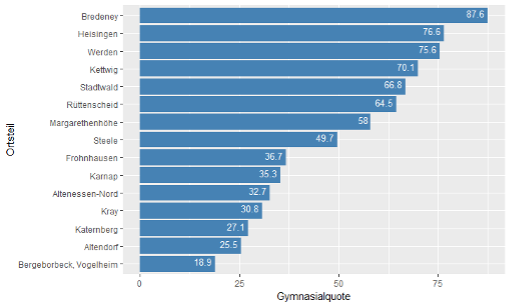
```


Abbildung \@ref(fig:Mig-GR-Ruhrgebiet) dokumentiert, dass dieser Befund für das gesamte Ruhrgebiet relvant ist. Die Karte zeigt eine Stadtteiltypologie für kleinräumige Bezirke aus der  Studie **Wege zur Metropole Ruhr**. Die hellrot und rot dargestellten Bezirke (Typ 6 und 7) kennzeichnen ehemalige Arbeiterbezirke, die sich zu sozial benachteiligten Bezirken mit hohen Armutsquoten gewandelt haben.  Die Punkte stellen den Migrantenanteil  an den Grundschulen im RVR Gebiet dar: Erkennbar ist eine Überlagerung der sozialen mit der ethnischen Segregation, der Migrantenanteil an den Grundschulen konzentriert sich vor allem in den ärmeren Bezirken, so dass diese Grundschulen eine zweifache Integrationsleistung übernehmen müssen.

```{r Mig-GR-Ruhrgebiet, fig.cap="Migrantenanteil an den Grundschulen im Ruhrgebiet 2014/15. Quelle: Studie **Wege zur Metropole Ruhr** (2017), amtliche Schuldaten Grundschulen NRW."}
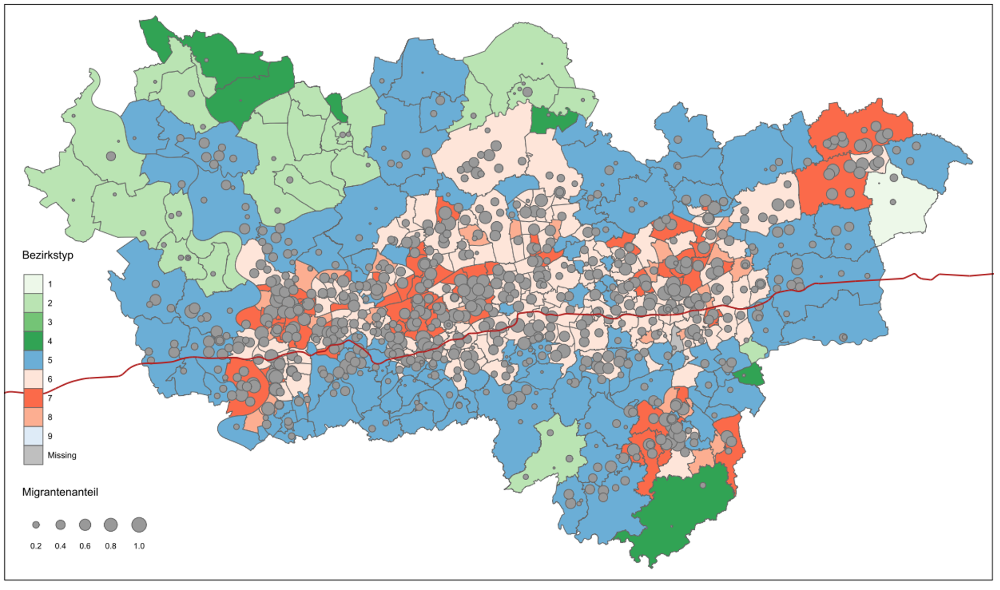
```

Unsere Studie untersuchte die sozioökonomische Entwicklung der Stadtteile über die letzten 50 Jahre hinweg und analysierte die Bildungsteilhabe. Im Ergebnis bestehen weiterhin extreme sozialräumliche Unterschiede zwischen den Stadtteilen und insgesamt liegen im Ruhrgebiet weiterhin sowohl das Bildungsniveau der Bevölkerung als auch die erreichten Schulabschlüsse unter der jungen Bevölkerung deutlich unter dem Niveau vergleichbarer städtischer Regionen. Die Studie endete mit dem dringenden Appell, den Sozialraum und die Struktur der Schülerinnen und Schüler an den Schulen in den sozial benachteiligten Bezirken stärker bei der Förderung der Schulen zu berücksichtigen.

## Blick in die Zukunft – die Auswirkungen des demographischen Wandels auf den Bildungs- und Qualifikationsraum Ruhr

Diese Empfehlung gilt umso mehr, wenn der Blick nicht nur aus der Vergangenheit auf die Gegenwart, sondern für die Region in die Zukunft gerichtet wird und die möglichen Konsequenzen dieser Bildungsdisparitäten sowohl für die Menschen als auch für die Region im Zusammenhang mit dem demographischen Wandel ins Auge gefasst wird. 
In letzter Zeit wurde viel über die Zukunft des Ruhrgebiets spekuliert. In einem Gutachten wird u.a. festgestellt [@IW-Gutachten.2018], 

* dass der relativ geringe Anteil an Abiturienten und hoch qualifizierten Kräften ein Entwicklungshemmnis für die Wirtschaft des Ruhrgebietes darstellt. <cite>Mit nur 12,5 Prozent der Beschäftigten ist der Anteil der Höherqualifizierten im Ruhrgebiet niedriger als in Deutschland insgesamt. Besonders fällt der Rückstand gegenüber den vergleichbaren urbanen Regionen aus; die 70 Städte mit mindestens 100.000 Einwohnern erreichen schon 21 Prozent, die sieben großen Modellregionen fast 20 Prozent.</cite> [@IW-Gutachten.2018, S. 22]. 
* Bei einem Blick auf die Beschäftigungsentwicklung seit dem Jahr 2000 kann festgestellt werden, dass das Ruhrgebiet gegenüber anderen Metropolregionen und dem gesamtdeutschen Durchschnitt abfällt. Diese Entwicklung wirkt durch den Arbeitsmarktboom ab 2012 verstärkt, von dem das Ruhrgebiet nicht profitieren kann. Diese Entwicklung korrespondiert zudem mit einer weit unterdurchschnittlichen Frauenerwerbsquote. 
* Es besteht eine relativ ungünstige demographische Entwicklung mit langanhaltender Abwanderung, die derzeit nur durch die temporäre Flüchtlingsmigration gemindert ist. Um den „Brain Drain“ zu stoppen, müssen gut qualifizierte junge Kräfte gehalten werden (vgl. S. 55). 
* In einer nach Stärken und Schwächen gerankten Darstellung der Regionen Deutschlands (Regionalindex auf Basis von 30 Indikatoren nach einer Methode der OECD 2008) liegt das Ruhrgebiet überwiegend im untersten Fünftel der deutschen Kreise. In dem Gutachten wird darauf hingewiesen, dass es nur in Ostdeutschland noch flächendeckend vergleichbare Problemlagen gibt [@IW-Gutachten.2018, S. 21].

Die demographische Entwicklung wird Folgen für den regionalen Arbeitsmarkt im Ruhrgebiet haben, es werden bald Arbeitskräfte fehlen, die die *passende* Qualifikation aufweisen. Die geburtenstarken Jahrgänge 1950-1965 werden in den kommenden zwanzig Jahren aus dem Arbeitsleben ausscheiden und durch deutlich schwächere Geburtenjahrgänge ersetzt.

Das Qualifikationsprofil, d.h. die Abstimmung zwischen verfügbaren und benötigten Qualifikationen des Arbeitskräfteangebots wird in Zukunft besonders relevant sein. Arbeitsmarktprognosen [@BundesministeriumfurArbeitundSoziales.Juli2013; @Maier.2014] sagen übereinstimmend einen steigenden Qualifikationsbedarf bei den Erwerbstätigen voraus. Gleichzeitig prognostizieren sie bei unverändertem Qualifikationsangebot einen langfristigen Überhang an Unqualifizierten von 1,2 bis 1,4 Millionen, die trotz sinkendem Arbeitskräfteangebot wegen fehlender Qualifikation nicht in den Arbeitsmarkt integriert werden können. Die beiden Vorausschätzungen zum qualifikationsspezifischen Arbeitskräftebedarf unterscheiden sich nur hinsichtlich des Ausmaßes des Rückgangs an Beschäftigungsmöglichkeiten für Unqualifizierte und des Anstiegs hochqualifizierter Arbeitsplätze: in der Tendenz stimmen sie überein [s. auch @Weishaupt.2016]. Nach einer Regionalprognose von BIBB/IAB wird ein Drittel des Überhangs an Unqualifizierten in Deutschland in NRW leben [@Zika.2015].

Insgesamt zeigt das Ruhrgebiet bereits jetzt schon eine schwierige Situation bei der Rekrutierung von Fachkräften für die Wirtschaft, sie ist allerdings derzeit noch durchaus vergleichbar mit der Situation im Bundesgebiet. In dem IW-Gutachten wird argumentiert, dass eine Zuwanderung auf Dauer die Probleme des demographischen Wandels nicht lösen wird, es bleibt als Potenzial nur der Weg der Qualifizierung und eine Erhöhung der bislang niedrigen Frauenerwerbsquote um Engpässe zu reduzieren [vgl. @IW-Gutachten.2018]. Um den Ersatz der bisher Beschäftigten auf gleichem Qualifikationsniveau sicherzustellen, ist letztlich eine Erhöhung des Anteils besser qualifizierter Absolventinnen und Absolventen des Bildungssystems notwendig. Damit ist nicht in erster Linie die Zahl an Studierenden gemeint, vielmehr geht es hier vor allem um qualifizierte Fachkräfte und die Vermeidung von Beschäftigten ohne abgeschlossene Berufsausbildung.

Nach dem Anstieg der Bildungsbeteiligung in den letzten Jahrzehnten gibt es nur noch zwei Gruppen unter den Heranwachsenden, die über eine intensivierte schulische Förderung zu höheren Schulabschlüssen und einem besseren Kompetenzniveau geführt werden können: arme Kinder [@Quenzel.2010;@Tophoven.2016] und Kinder mit Migrationshintergrund [@Autorengruppe.2016]. Zur Verdeutlichung: Unter der 20jährigen Bevölkerung in NRW haben über 40% einen Migrationshintergrund mit eher niedriger Bildungsbeteiligung und ein Viertel eine nichtdeutsche Familiensprache. Der Bildungsstand der jüngeren erwachsenen Migranten ist deutlich schlechter als der der Nichtmigranten: ein Drittel hat keine abgeschlossene Berufsausbildung.<!-- Beispiel Armut?-->

Eine Verringerung der Bildungsbenachteiligung von Kindern, die in finanziell prekären Verhältnissen aufwachsen und/oder einen Zuwanderungshintergrund aufweisen, ist nicht nur eine Gerechtigkeitsfrage, sondern in Zukunft auch eine Frage der ökonomischen Zukunft der Gesellschaft und der Region. Das Erschließen neuer *Bildungspotenziale* kann, neben der Erhöhung der Frauenerwerbsquote und der Qualifizierung von Langzeitarbeitslosen, einen Beitrag leisten, um die grundlegend veränderten Konstellationen am Arbeitsmarkt  und dem steigenden Bedarf an qualifizierten Arbeitskräften gerecht zu werden [vgl. @Weishaupt.2016]. Für das Ruhrgebiet ist dies von besonderem Gewicht, weil die Bemühungen der letzten Jahrzehnte nicht die Abwanderung Hochqualifizierter verhindern konnten und es für die Region noch schwieriger werden wird, angesichts zunehmender Konkurrenz um qualifizierte Beschäftigte, sich im interregionalen und internationalen Wettbewerb zu behaupten.

## Ziel der Studie

Ziel unserer Studie ist es, die zu erwartende zukünftige Entwicklung der Bildungsdisparitäten und des qualifikationsspezifischen Arbeitskräfteangebots regional darzustellen und zu prüfen in welchem Verhältnis das zukünftige Arbeitskräfteangebot und die Qualifikationsnachfrage in NRW und im Ruhrgebiet steht. Mit Blick auf die Absolventinnen und Absolventen der nordrhein-westfälischen Schulen und den zukünftigen Bedarf an Erwerbstätigen, soll das Angebot und die Nachfrage an Qualifikationen auf Basis von Vorausberechnungen zusammen betrachtet werden. 

Die Darstellung der Entwicklung des Qualifikationsangebots erfolgt auf Basis einer **integrierten Vorausberechnung**, die die Bildungsteilnehmerinnen und Bildungsteilnehmer an den allgemeinbildenden Schulen, den beruflichen Schulen einschließlich der Gesundheitsschulen und einer Aufstiegsfortbildung als auch die an den Hochschulen einschließt. Auf dieser Grundlage können Aussagen über die Entwicklung des Arbeitskräfteangebots nach *Anforderungsniveau* der *KLassifikation der Berufe 2010* (KldB) (Helfer, Fachkraft, Spezialist, Experte) getroffen werden.
In Bezug auf die Modellierung eines Teils des Qualifikationsangebots, der Schülervorausberechnung für den Primar- und Sekundarbereich, gehen wir in unserer Studie neue Wege. Erstmals erfolgt die Modellierung nicht, wie sonst bei regionalen Schülervorausberechnungen üblich auf Kreisebene, sondern auf **Schulebene**. Durch eine Aggregation bzw. Mittelung der Bestände, Übergänge und Quoten auf Schulform- und Kreisebene, würde die weiter oben und in unserer Studie **Wege zur Metropole Ruhr** aufgezeigte große räumliche Heterogenität der Bildungsbeteiligung innerhalb der Kreise unberücksichtigt bleiben. Durch die Ermittlung und Nutzung von schulspezifischen Quoten kann diese Heterogenität z.B. bei dem Übergang von der Grundschule zum Gymnasium abgebildet und im Fortgang auch im Rahmen von Zukunfts-Szenarien manipuliert werden. So ist neben der Darstellung der zukünftigen Entwicklung des regionalen qualifikationsspezifischen Arbeitskräfteangebots unter der aktuellen Bevölkerungsvorausberechnung und den sonst üblichen ceteris paribus Bedingungen ein weiteres Ziel der Studie, mögliche Auswirkungen von Änderungen, z.B. der selektiven Erhöhung der Bildungsbeteiligung, wie etwa der Übergangsquote zum Gymnasium bei Grundschulen in sozial benachteiligtem Umfeld oder einer Änderung der in der Bevölkerungsvorausberechnung angenommenen Zuwanderung, aufzuzeigen. Zu diesem Zweck wird auch eine frei zugängliche **Shiny-App** entwickelt die einen interaktiven Abruf ausgewählter Szenarien erlaubt.  

Bei unseren Betrachtungen in Bezug auf die Nachfrage nach Qualifikationen stützen wir uns auf die Berufsbereiche der *Klassifikation der Berufe 2010* (KLDB10, 1-Steller) sowie die den Berufen zugeordneten Anforderungsniveaus. Unsere in Bezug auf die Nachfrageseite eher einfach gehaltene Vorausberechnung kann insofern nicht mit komplexen Arbeitsmarktprojektionen wie dem QuBe-Projekt des IAB/BIBB [@Maier.2014] verglichen werden, bei denen Vorausberechnungen für einzelne Berufsfelder durchgeführt werden. Der Schwerpunkt unserer Betrachtungen liegt auf der Angebotsseite, d.h. der Vorausberechnung von Qualifikationen, die sich durch Schulabschlüsse und Berufsabschlüsse bzw. Studium unter bestimmten Voraussetzungen ergeben. 

Überlegungen zum künftigen Arbeitskräftebedarf gehen verallgemeinernd davon aus, dass erst ein Wirtschaftswachstum, das über den Produktivitätsfortschritt (insbesondere über die Ersetzung von Arbeitskräften durch Maschinen) hinausgeht, zu steigendem Arbeitskräftebedarf führt. Fehlendes und niedriges Wachstum senken den Arbeitskräftebedarf. Als Orientierungswert kann angenommen werden, dass jährlich etwa drei Prozent der Beschäftigten aus Altersgründen ersetzt werden müssen (bei einer durchschnittlichen Beschäftigungsdauer von 33 Jahren). Über die dadurch neu in das Beschäftigungssystem kommenden jungen Erwerbstätigen vollzieht sich im Idealfall relativ problemlos eine Anpassung an den wirtschaftlichen Strukturwandel. Voraussetzung ist jedoch, dass die jungen Erwerbstätigen die entsprechenden Qualifikationen mitbringen. Schon hierdurch zeigt sich, dass diese allgemeine Entwicklung sich nicht auf jede Region übertragen lässt, weil sie durch eine spezifische Wirtschaftsstruktur und regionale und infrastrukturelle Standortbedingungen stark unterschiedliche Entwicklungsperspektiven aufweisen können. Deshalb ist es notwendig, eine Analyse der Angebots-Nachfragekonstellationen spezifisch für NRW beziehungsweise dem Ruhrgebiet durchzuführen. 
Im Fokus der Betrachtung steht die Entwicklung im Ruhrgebiet, als Vergleichsregionen in Nordrhein-Westfalen dienen das Rheinland und Westfalen. Diese regionale Einteilung orientiert sich dabei an dem Vorgehen im regionalen Bildungsbericht Ruhr [@RuhrFutur.2020]. Die Abbildung \@ref(fig:vergleichsregionen) zeigt die Zuordnung der Kreise und kreisfreien Städte zu den drei Regionen.

```{r vergleichsregionen, fig.asp=1, crop=T, fig.cap = "Karte der Vergleichsregionen", fref=TRUE}
bev_map <- krsT_sf[krsT_sf$SN_L=="05",]

  tm_shape(reg[reg$SN_L=="05",]) + tm_borders(lwd=2)  +
  tm_fill("Group.1", title="Region", palette  = colpal)  +
  tm_shape(bev_map) +   tm_borders(lwd=.5)  +
      tm_layout(main.title = "Vergleichsregionen in NRW") +
      tm_add_legend(type = "line", label = c("Grenzen der Kreise und kreisfreien Städte", "Grenzen der Regionen"), lwd = c(0.5, 2)) 
#      tm_credits(figcap())

```

<!-- Das **zukünftige Qualifikationsangebot** wird über eine regionale Schülervorausberechnung auf Schulebene berechnet, wobei bei der Spezifizierung der Übergangsquoten vom Primar- in die Sekundarstufe I und später von der Sekundarstufe I in die Sekundarstufe II- auch weitere Informationen wie etwa die Verteilung der *sozialen Benachteiligung* an den Schulstandorten oder Zuwanderung von Migranten in die Stadtteile mit einbezogen werden können.  -->
<!-- TODO: Anpassen an Ergebnisse --> 
<!-- Solche lokalen Unterschiede beeinflussen auch die regionalen Übergangsquoten. Ermittelt werden die Schüleranzahl für Primar-, Sek I- und Sek II-Bereich sowie Anzahl der Abgänger und Absolventen auf Kreisebene bis zum Jahr 2040. -->

<!-- Darüber hinaus wird das Qualifikationsangebot in der beruflichen Ausbildung durch eine Vorausberechnung der Schülerinnen und Schüler der beruflichen Schulen nach Teilzeit-, Vollzeitberufsschulen und beruflichen Gymnasien/zweijährige Fachoberschule und das Übergangssystem für NRW und auf Kreisebene sowie das Ruhrgebiet insgesamt bis zum Jahr 2040 beschrieben. Auf dieser Grundlage können Aussagen über die Entwicklung des Arbeitskräfteangebots nach Qualifikationsniveau (Helfer/-in, Fachkraft, Spezialist/-in, Experte/in) getroffen werden. -->

Die **Qualifikationsnachfrage** aus der Wirtschaft kann nicht direkt auf Kreisebene vorausberechnet werden. Hier können aber Annahmen auf Basis vorliegender Studien z.B. des BIBB/IAB auf der Ebene der Bundesländer getroffen und Prognosen über mögliche Engpässe bis 2035 aufgezeigt werden (Qube-Datenportal). Die Anforderungsstruktur der Arbeits- und Qualifikationsnachfrage am Arbeitsplatz wird maßgeblich von den regionalen Wirtschaftsstrukturen und den damit einhergehenden Tätigkeiten beeinflusst. Angenommen wird, dass in allen Regionen eine steigende Komplexität der Anforderungen auf den Arbeitsplätzen zu beobachten sein wird. Im regionalen BIBB Report aus dem Jahr 2017 (3/2017) wird davon ausgegangen, dass der Anteil an Spezialisten/Spezialistinnen und Experten/Expertinnen an allen Erwerbstätigen etwa um 3 Prozentpunkte zunehmen wird, dementsprechend werden weniger Arbeitsplätze auf Helfer- und Fachkraftniveau benötigt [@Zikaetal..2017, S.6-7].
Das erforderliche Qualifikationsprofil der Erwerbstätigen wird damit in den kommenden Jahren eher weiter ansteigen, in der vorgeschlagenen Studie soll daher u.a. geprüft werden, ob die Zahl der höher qualifizierten Berufsanfänger in der Region zumindest konstant gehalten werden kann oder ob sich Lücken zeigen werden. Zudem soll geprüft werden, ob mit einem Überhang an weniger qualifizierten Berufsanfänger im Ruhrgebiet zu rechnen ist.

In einer aktualisierten QuBe-Basisprojektion wurden auch kurzzeitige Effekte der Anfang des Jahres 2020 aufgetretenen **Covid-19-Pandemie** berücksichtigt [@Zika.2021]. In dieser Projektion wird davon ausgegangen, dass aufgrund des Shutdowns das Bruttoinlandsprodukt um insgesamt 8,4 Prozent niedriger ausfällt. Die mittel- und langfristigen Auswirkungen auf die künftigen Entwicklungen für Wirtschaft und Arbeitsmarkt sind noch unklar. Man geht allerdings davon aus, dass die zentralen Befunde vor der Pandemie weiterhin Bestand haben und rechnet damit, dass der seit Jahren festzustellende Strukturwandel, weg vom Produzierenden Gewerbe, hin zu den Dienstleistungen, noch beschleunigt werden dürfte [@Zika.2021, S. 16]. 

Für die Vorausberechnung von Angebot und Nachfrage werden nachfolgend in unserer Studie je nach Bildungsbereich unterschiedliche Ebenen und Daten verwendet. Die Tabelle \@ref(tab:EbenenDaten) gibt hierzu einen Überblick.    


```{r EbenenDaten, echo=FALSE, tab.cap="Ebenen und Daten für die Vorausberechnung des Qualifikationsangebots und der -nachfrage"}
Quali <- data.frame(
                   Qualifikation = c("Angebot","","","","","","Nachfrage","Match"),
                   Bereiche = c("Primarbereich","Sekundarbereich","Berufliche Schulen","Gesundheitsschulen","Aufstiegsfortbildung","Hochschulen", "KldB: Berufsbereiche u. Anforderungsniveau","Angebot und Nachfrage"), 
                   Vorausberechnung.auf = c("Schulebene","Schulebene","Kreisebene","Kreisebene","Kreisebene","Regionen","Regionen","Regionen"),
                   Datenbasis = c("Schulstatistik","Schulstatistik","Schulstatistik","Schulen des Gesundheitswesens","Berufsbildungsstatistik","Hochschulstatistik","Mikrozensus",""))

ft <- flextable(Quali, defaults = TRUE)

ft <- set_header_labels(ft, Vorausberechnung.auf = "Vorausberechnung auf")

ft <- align_text_col(ft, align = "left")
ft <- align_nottext_col(ft, align = "right")

ft <- footnote(ft, i = 1, j = 1,
            value = as_paragraph(
              "eigene Zusammenstellung"),
#           ref_symbols = "a"),
            part = "header")

ft <- autofit(ft, add_w = 0.1, add_h = 0.1, part = c("body", "header"))

ft
```


# Bevölkerungsentwicklung in NRW und den Regionen

Ausgangspunkt für eine Vorausberechnung des Erwerbspersonenangebots bzw. des Qualifikationsangebots ist die weitere Bevölkerungsentwicklung einschließlich der Entwicklung der Zu- und Abwanderung. Am 15 Juli 2019 hat das Statistische Landesamt IT.NRW seine aktuelle regionale Bevölkerungsprognose für Nordrhein-Westfalen veröffentlicht. Sie basiert auf den Bevölkerungszahlen zum 01.01.2018, welche der Fortschreibung des Bevölkerungsstands zum Stichtag 31.12.2017 entsprechen. Als methodische Grundlage wird eine Komponentenmethode verwendet, welche eine jahrgangsweise Fortschreibung nach Alter und Geschlecht vorsieht, wobei Gestorbene und Fortgezogenen abgezogen und Geburten und Zugezogene hinzugezählt werden [vgl. @InformationundTechnikNordrheinWestfalen.Juli2019, S. 4].[^Annahmen] 

[^Annahmen]:Diese regionale Vorausberechnung basiert auf verschiedenen Annahmen in Bezug auf Fertilität, Mortalität und Migration. Auf Landesebene wird z.B. von 2018 bis 2020 von einer Fertilitätsrate von 1,61, von 2021 bis 2034 von 1,56 und ab 2035 von 1,51 ausgegangen. Die Säuglingssterblichkeit wird konstant gehalten, bei der Lebenserwartung wird eine schwache Steigerung angenommen. In Bezug auf den Wanderungssaldo wird für ganz NRW von 2018 bis 2020 ein jährliches Plus von 58.000, von 2021 bis 2029 von 60.000 und ab 2030 von 55.000 angenommen [vgl. @InformationundTechnikNordrheinWestfalen.Juli2019, S. 11].

Auf Basis der Modellrechnung werden in 22 der 53 kreisfreien Städte und Kreise die Einwohnerzahlen steigen, in den restlichen Kreisen sind Rückgänge zu erwarten. Bis zum Jahr 2040 wird entsprechend der Prognose die Bevölkerung in NRW insgesamt um 0,9 Prozent ansteigen. Die Entwicklung in den hier betrachteten Regionen wird in Abbildung \@ref(fig:demografieRegionen) dargestellt. Ein leichter Zuwachs um etwa 5 Prozentpunkte verzeichnet das Rheinland, während das Ruhrgebiet und Westfalen einen Rückgang um ca. 2,2 Prozentpunkte hinnehmen müssen.   

```{r demografieRegionen, fig.cap = "Bevölkerungsentwicklung 2018 bis 2040 in den Regionen bezogen auf das Basisjahr 2018 in Prozent. Quelle: DESTATIS Regionaldatenbank Deutschland.", fig.asp = 0.6, fref=TRUE}

library(ggplot2)
# Kreise

bev_alter <- readRDS("./Tabellenvorlagen/bev_alter.RDS")

# Regionen ingsgesamt
bev_reg <- readRDS(file = "./Tabellenvorlagen/bev_reg.RDS")

ggplot(bev_reg[!is.na(Region), ], 
              aes(x = Jahr, 
           y = P, # Anzahl
           col = Region, 
           group = Region)) + 
  geom_line() +
#  scale_color_manual(values = colpal) + 
  geom_point(size = 1.0) + 
  scale_x_continuous(name =  "Jahr", breaks = c(2018, 2020, 2025, 2030, 2035, 2040), labels=c(2018, 2020, 2025, 2030, 2035, 2040)) +
  labs(title = "Bevölkerungsentwicklung in den Regionen",
       caption = figcap()) +
  xlab("Jahr") + ylab("Anteil in %")
```
Für das zukünftige Qualifikationsangebot ist weniger die allgemeine Bevölkerungsentwicklung entscheidend, als vielmehr die Entwicklung derjenigen Altersgruppen, die für den Arbeitsmarkt relevant sind. Welche Altergruppen dies nun sind, hängt von der konkreten Fragestellung ab: Im Hinblick auf den demographisch bedingten Ersatzbedarf im Jahre 2040 sind bereits die Geburtskohorten aus den späten 2010er Jahren von Bedeutung.

Im Bildungsbericht Ruhr wurde gezeigt, dass sich die Altersgruppe der unter Dreijährigen in dem Zeitraum von 2013 bis 2018, also kurz vor unserem Beobachtungsfenster, sehr dynamisch entwickelt hat. Den stärksten Zuwachs hatte dabei im regionalen Vergleich das Ruhrgebiet. Gegenüber 2013 ist diese Gruppe bis 2018 um 22,8 Prozent gewachsen. Dies gilt auch für die Altersgruppe der Drei- bis unter Sechsjährigen: Hier verzeichnet das Ruhrgebiet ein Plus von 13,2 Prozent im Vergleich zum Jahr 2013. Der Anstieg ging dabei zum Teil auf die Zuwächse bei den Geburten nichtdeutscher Eltern zurück [vgl. @RuhrFutur.2020, S.28]. 

Abbildung \@ref(fig:dem-bev-reg-alter) zeigt auf Basis der aktuellen regionalen Bevölkerungsprognose von IT.NRW die Entwicklung einiger Altersgruppen im Zeitverlauf für alle drei Vergleichsregionen in Prozent gegenüber dem Basisjahr im Zeitraum 2018 bis 2040. Erkennbar ist, dass auf Basis der Vorausberechnung, sich der enorme Zuwachs in der Altersgruppe der unter Dreijährigen im weiteren Verlauf bis zum Jahr 2040 im Ruhrgebiet wieder auf den Wert von 2013 abbauen wird. Hierbei wird allerdings davon ausgegangen, dass die hohe anfängliche 
Fertilitätsrate von 1,61 auf Landesebene bis zum Jahr 2040 auf einen Wert von 1,51 zurückgehen wird. Begründet wird dies u.a. mit Annahmen zur Auslandswanderung und einem allmählichen Rückgang der hohen Fertilität von ausländischen Frauen (vgl. Information und Technik Nordrhein-Westfalen (IT.NRW), 2019, S. 5). 
Die für die frühkindliche Bildung besonders relevante Altersgruppe der Drei- bis unter Sechsjährigen wird im Ruhrgebiet bis zum Jahr 2024 voraussichtlich weiter anwachsen und dann rückläufig sein. Eine ähnliche Entwicklung, nur auf einem etwas geringerem Niveau, wird auch für das Rheinland und Westfalen prognostiziert.
Die für das Pflichtschulsystem relevante Altersgruppe der 6 bis unter 18-Jährigen wird im Ruhrgebiet bis zum Jahr 2033 zunehmen und dann wieder leicht rückläufig sein. Im Rheinland steigt der Anteil der Altersgruppe bis 2034 und verbleibt dann in etwa auf diesem Niveau. In Westfalen verläuft die Entwicklung wellenförmig, insgesamt ist mit einem Rückgang der Altersgruppe zu rechnen.

Mittelfristig sind für den Arbeitsmarkt sind insbesondere die Anteile der Altergruppe von 25 bis 65 Jahren relevant. Hier zeigt sich in allen drei Regionen in Zukunft ein kontinuierlicher Rückgang. Bis zum Jahr 2040 beträgt der Rückgang gegenüber dem Basisjahr 2018 in NRW ca. 10 Prozentpunkte, im Rheinland nur moderate 6 Prozentpunkte, im Ruhrgebiet aber ca. 12 und in Westfalen sogar ca. 15 Prozentpunkte. Demgegenüber steigt der Anteil der Altergruppe der über 65 Jährigen enorm an. 


```{r dem-bev-reg-alter, fig.cap = "Bevölkerungsprognose bis 2040 in den relevanten Altersgruppen bezogen auf das Basisjahr 2018 in Prozent. Quelle: Regionaldatenbank DESTATIS, für 2018 Landesdatenbank NRW / IT.NRW.", fig.asp = 1.7, fref=TRUE}
# Regionen
bev_alter_reg <- readRDS(file = "./Tabellenvorlagen/bev_alter_reg.RDS")
#invisible(bev_alter_reg[, Region := sort_region(Region) ])

#bev_alter_reg[Region == "NRW" & Alter_Bildung == "6 bis unter 18" & Jahr %in% c(2019, 2034), Anzahl]

library(patchwork)


p1 <- ggplot(bev_alter_reg[!is.na(Region) & Region %in% c("Ruhrgebiet", "Rheinland", "Westfalen", "NRW") 
#                     & !(Alter_Bildung %in% c("25 bis unter 65", "65 und älter"))
                     & Jahr > 2017], 
       aes(x = Jahr, 
           y = P, #Anzahl
           col = Alter_Bildung, 
           group = Alter_Bildung)) + 
  geom_line() + 
  scale_color_discrete("Altersgruppe") + 
  geom_point(size = 0.3) + 
  facet_wrap(vars(Region), ncol = 2, scales = "free_x") +
  scale_x_continuous(name =  "Jahr", breaks = c(2018, 2020, 2025, 2030, 2035, 2040), labels=c(2018, 2020, 2025, 2030, 2035, 2040)) +
    labs(title = "Relevante Altersgruppen") +
#       caption = figcap()) +
  xlab("Jahr") + ylab("Anteil in %") +
      theme(legend.direction = "horizontal", legend.box = "vertical", legend.position = "bottom")

 p1 + plot_layout(heights = c(2, 2))

```


# Entwicklung des Qualifikationsangebots

Neben der Bevölkerungsentwicklung sind die Abgängerinnen und Abgänger aus dem Bildungssystem und deren formale berufliche Qualifikation für die Vorausberechnung entscheidend. 

Die nachfolgenden Abschnitte beschreiben das Vorgehen und die Annahmen für die Ermittlung des Qualifikationsangebotes.

## Allgemeinbildende Schulen in NRW

Das Schulsystem in Nordrhein-Westfalen ist in drei Stufen unterteilt. Der Primarbereich, die Sekundarstufe I und die Sekundarstufe II [@MinisteriumfurSchuleundBildungdesLandesNordrheinWestfalen.15.02.2005b, S. 13].
Die ersten vier Klassen ihrer Schullaufbahn durchlaufen die SchülerInnen in der Grundschule im Primarbereich. Die Grundschule soll grundlegende Fähigkeiten, Kenntnisse und Fertigkeiten vermitteln. Sie soll den SchülernInnen lehren, systematisch zu Lernen und somit die Basis für die weitere schulische Entwicklung legen [@MinisteriumfurSchuleundBildungdesLandesNordrheinWestfalen.15.02.2005b, S. 13].

Die Klassen 1 und 2 der Grundschule bilden die Schuleingangsphase. In der Vorausberechnung werden die Klassen der Schuleingangsphase mit E1 und E2 bezeichnet. Ein Kind verbleibt in der Regel zwei Jahre in der Eingangsphase, es besteht allerdings auch die Möglichkeit, ein Jahr länger in der Schuleingangsphase zu verbleiben, dies wird durch E3 gekennzeichnet [@MinisteriumfurSchuleundBildungdesLandesNordrheinWestfalen.15.02.2005b, S. 14]. Die beiden weiteren Jahrgänge werden im Primarbereich mit 03 sowie 04 bezeichnet. Im Schuljahr 2018/19 befanden sich in Nordrhein-Westfalen insgesamt **XXX** Kinder im Primarbereich. 
Landesweit befinden sich die meisten SchülerInnen in Grundschulen (**XXX %**), nur ein kleiner Teil wird in Freien Waldorfschulen unterrichtet (**XXX %**)

Zu den Schularten, die ausschließlich den Sekundarbereich I angehören und die Klassenstufen 5 bis 10 betreffen, zählen die Hauptschule, die Realschule sowie in NRW auch die Sekundarschule und die Gemeinschaftsschule. Die jeweiligen Schulformen der Sekundarstufe I~sollen auf der Grundschule aufbauen, und ihren SchülernInnen eine gemeinsame Grundbildung vermitteln, welche sie befähigen soll, im Anschluss an die Sekundarstufe I in eine Berufsausbildung zu treten oder oder die vollzeitschulischen allgemeinbildenden bzw. beruflichen Bildungsgänge der Sekundarstufe II einzutreten [@MinisteriumfurSchuleundBildungdesLandesNordrheinWestfalen.15.02.2005b, S. 14-15].

Zu den Schularten, die neben dem Sekundarbereich I auch den Sekundarbereich II abdecken, gehören die Gymnasien (GY), die Integrierten Gesamtschulen (IGS) und die Freien Waldorfschulen (FWS). Bei den Gymnasien wird zudem noch teilweise zwischen Bildungsgängen G8 und G9 unterschieden. Die Landesregierung hat beschlossen, dass zum Schuljahr 2019/2020 alle Gymnasien wieder zu dem Bildungsgang G9 zurückkehren sollen, die sich nicht aktiv für eine Beibehaltung von G8 aussprechen. Von allen Gymnasien haben sich in letztlich landesweit nur 3 Gymnasien entschieden, den verkürzten Bildungsgang G8 beizubehalten. 

Die hier durchgeführte Vorausberechnung der Schülerinnen und Schüler der allgemeinbildenden Schulen im Primarbereich sowie im Sekundarbereich I und II berücksichtigt alle in Abbildung \@ref(fig:Schulformen) aufgelisteten Schulformen. Sie erfolgt schulscharf, wobei die Schülerbestände und Absolventenzahlen auf Kreisebene aggregiert werden. 

```{r Schulformen, fig.cap = "Quelle: eigene Darstellung"}
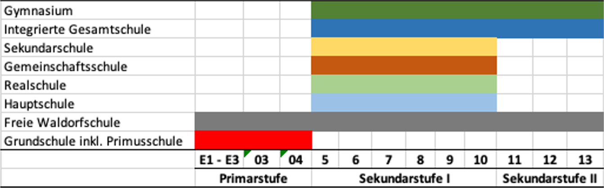
```
Quelle: Eigene Darstellung


### Vorausberechnung der Schülerinnen und Schüler an allgemeinbildenden Schulen

#### Datengrundlage

Für die Vorausberechnung der Zahlen der Schülerinnen und Schüler und Schulabschlüsse werden Daten des Statistischen Landesamtes NRW (IT.NRW) verwendet. Grundlage der Berechnungen sind die Amtlichen Schuldaten für die Schuljahre 2014/15 bis 2018/19 in Nordrhein-Westfalen, die uns von IT.NRW zur Verfügung gestellt wurden. Zudem werden Daten zur regionalen Vorausberechnung der Bevölkerung in den kreisfreien Städten und Kreisen Nordrhein-Westfalens genutzt [@InformationundTechnikNordrheinWestfalen.Juli2019]. 


Grundlage für die Vorausberechnung der Zahlen der Schülerinnen und Schüler an den allgemeinbildenden Schulen ist die Ermittlung der Schulanfängerinnen und Schulanfänger. Verwendet werden hierfür kreis- und altersspezifische Schulanfängerquoten. In Nordrhein-Westfalen wird jedes Kind, das bis zum Beginn des 30. September das sechste Lebensjahr vollendet hat, zum 1. August des gleichen Jahres schulpflichtig. Alle Kinder, die am 1. Oktober oder später sechs Jahre alt werden, sind erst im folgenden Kalenderjahr schulpflichtig (näheres hierzu findet sich auf der 
[Website des MSB](https://www.schulministerium.nrw/anmeldung-zur-grundschule)). 

#### Methodik

Für die Modellierung des Schulverlaufs wird ein Komponentenmodell verwendet, welches teilweise auch von den Statistischen Ämtern zur Vorausberechnung genutzt wird. [vgl. @InformationundTechnikNordrheinWestfalen.Mai2020; @Schulz.2013 sowie @Schrapler.November2010]. 
Bei diesem Modell wird der Übergang der Schülerinnen und Schüler zwischen den Klassenstufen und der Wechsel der Schulformen durch mehrere Quoten beschrieben und fortgeschrieben. Die hier vorgenommene komprimierte Darstellung des Modells orientiert sich eng an den Ausführungen in @Schrapler.November2010.

Ausgangspunkt für die Ermittlung dieser Quoten sind die Schülerinnen und Schüler eines neuen Schuljahres und deren Beziehung zum vorangegangenen Schuljahr. Um stabile Quoten zu erhalten, werden diese für die Schuljahre 2014/15 bis 2018/19 gemittelt. Im Gegensatz zu der regionalisierten Schülervorausberechnung des Statistischen Landesamtes NRW [vgl. @InformationundTechnikNordrheinWestfalen.Mai2020] werden in dem vorliegenden Modell erstmalig diese Quoten schulscharf und zudem wesentlich differenzierter berechnet. Die Berechnung der Quoten erfolgt nicht, wie in anderen regionalen Vorausberechnungen üblich, für Schulformen aggregiert auf Kreisebene, sondern auf Schulebene. Jede einzelne Schule $P$ wird separat betrachtet, was einerseits die Komplexität der Vorausberechnung deutlich erhöht, andererseits aber auch Szenarien auf Schulebene ermöglicht.       

In dem Modell werden drei Schülertypen unterschieden, die als Komponenten über Jahrgangsquoten (Schuljahr $j/(j+1)$) separat fortgeschrieben werden können. Beim überwiegenden Teil der Schülerinnen und Schüler in der neuen Klassenstufe handelt es sich um Versetzte $V$, also Schülerinnen und Schüler die im Vorjahr $(j-1)/j$ die gleiche Schule besucht haben und in die nächst höhere Klassenstufe gewechselt sind. Darüber hinaus unterscheidet das Modell Wiederholer $W$ (Schülerinnen und Schüler die nicht versetzt wurden, treten erst ab der 3. Klasse auf) sowie Zugängerinnen und Zugänger $Z$ (Schülerinnen und Schüler von anderen Schulen, anderen Bundesländern sowie aus dem Ausland). Diese Differenzierung in einzelne Schülertypen ermöglicht es, im Komponentenmodell die Wechselwirkung zwischen den einzelnen Schulen direkt zu berücksichtigen und die Schülerinnen und Schüler für alle Schulen und Jahrgänge vorauszuberechnen. Die Schülerbestände in jeder KLassenstufe $k$ einer Schule $P$ werden mit $S$ bezeichnet. In Abbildung \@ref(fig:Primarbereich) wird das Vorausberechnungsprinzip dargestellt, welches auch für die weiterführenden Schulen angewendet wird. Wie weiter oben schon erwähnt, erfolgt im Primarbereich der Eintritt über alterspezifische schulbezogene Einschulungsquoten $e^{P}_{GR,5-7,j(j+1)}$, die sich auf die Bevölkerung $B$ im jeweiligen Kreis beziehen. Die Schülerinnen und Schüler verbleiben zunächst individuell mindestens 2, maximal 3 Jahre in der Schuleingangsphase E1 bis E3. Für die Modellierung werden die Stufen E2 und E3 zusammengefasst der Übergang von E1 zu E2/E3 erfolgt über eine Quote. Die erste Versetzung erfolgt nach der Schuleingangsphase in die Klasse 03. Die Versetzungsquote $v^{P}_{GR,3,j/j+1}$ ergibt sich dann aus dem Schülerbestand in Klasse 03 zur Anzahl an Schülerinnen und Schüler in E2 und E3. 

```{r Primarbereich, fig.cap = "Vorausberechnungsmodell für den Primarbereich. Quelle: eigene Darstellung"}
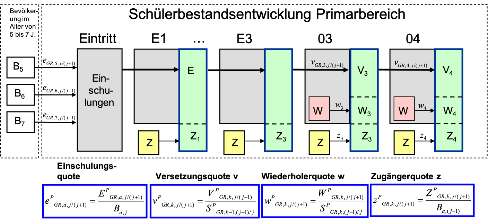
```
Quelle: Eigene Darstellung

Der Übergang vom Primarbereich der Klasse 04 zum Sekundarbereich I der Jahrgangsstufe $k=5$ der weiterführenden Schulen erfolgt dann mittels Übergangsquoten $u_{j/(j+1)}^{PH}$, wobei $P$ der Index für die aufnehmende und $H$ der Index für die Herkunftsschule ist. Die schulspezifische Übergangsquote wird aus dem Verhältnis der Anzahl an Schülerinnen und Schüler in Klasse 5 einer weiterführenden Schule $P$ zur Anzahl an Schülerinnen und Schüler in Klasse 4 der Herkunftsschule $H$ aus dem vorherigen Schuljahr ermittelt. Das Vorausberechnungsprinzip wird in Abbildung \@ref(fig:Sekundarbereich) dargestellt. 

Die Vorausberechnung der jahrgangsbezogenen Schülerbestände ergibt sich wieder aus den Versetzungsquoten $v^{P}_{j/(j+1)}$, Wiederholerquoten $w^{P}_{j}$ und Zugängerquoten $z^{PH}_{j}$. In der Abbildung wird als Beispiel zur Anschauung die Schulform eines Gymnasiums (G9) verwendet. Die anderen Schulen und Schulformen im Sekundarbereich werden analog berechnet. Neben der Anzahl an Schülerinnen und Schüler werden in dem Modell über Absolventenquoten am Ende auch die Anzahl an Schulabsolventinnen und Schulabsolventen nach Art des Abschlusses ermittelt. Es wird zwischen fünf verschiedenen Absolventen differenziert: Abgänger ohne Abschluss ($A_{oA}$), mit Hauptschulabschluss ($A_{HSA}$), mit mittlerem Abschluss ($A_{MA}$), mit Fachhochschulreife ($A_{FHR}$) und Hochschulreife ($A_{HR}$).

```{r Sekundarbereich, fig.cap = "Vorausberechnungsmodell für den Sekundarbereich. Quelle: eigene Darstellung"}
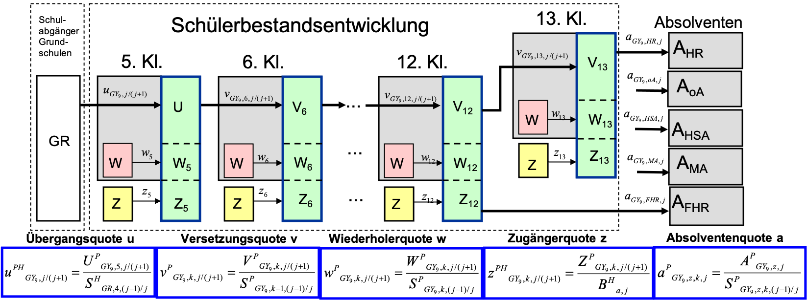
```
Quelle: Eigene Darstellung


Für die Förderschulen wird kein Komponentenmodell verwendet. Hier werden über die Jahre hinweg fixe Anzahlen angesetzt. Dieses Vorgehen orientiert sich an der landesspezifischen Vorausberechnung des Ministeriums für Schule und Bildung (@MinisteriumfurSchuleundBildungdesLandesNordrheinWestfalen.Oktober2017).
Die ermittelten schulscharfen Ergebnisse können im weiteren Verlauf dann auf Ebene der Kreise oder Regionen aggregiert werden.


#### Ergebnisse

##### Entwicklung der Schülerzahlen im Primarbereich

Die Abbildung \@ref(fig:ErgPrim) zeigt die Entwicklung der Schülerzahlen für den Primarbereich, aggregiert für die drei Regionen. Die linke Abbildung *A* weist die prognostizierte Anzahl der Schülerinnen und Schüler aus, die Abbildung *B* die Veränderungen zum Schuljahr 2019/20. Die Entwicklung der Schüleranzahlen verläuft in den Regionen relativ ähnlich. Im Primarbereich steigt die Anzahl im Ruhrgebiet bis zum Schuljahr 2026/27 um 16,4 % an, im Rheinland sind dies ca. 14 % und in Westfalen 11,6 %. Gegenüber dem Basisjahr 2019/20 fällt danach die Anzahl der Schülerinnen und Schüler im Jahr 2040 im Ruhrgebiet wieder auf ein PLus von 3,6 %, im Rheinland sind es noch 8,6 % und in Westfalen ist sogar ein leichter Rückgang von 1,8 % zu verzeichnen.   

```{r ErgPrim, fig.cap = "Vorausberechnung der Anzahl an Schülerinnen und Schüler für den Primarbereich. Quelle: eigene Berechnung", fig.asp = 0.6, fref=TRUE}
library(tidyverse)
library(data.table) 
# Ergebnisse laden       
            files <- list.files(path = "../../Ergebnisse/Primar", pattern = "\\.rds$", full.names = TRUE)
            data_list <- lapply(files, readRDS)
            testdat = rbindlist(data_list, fill = TRUE, idcol="ID")
            testdat$year <- as.numeric(testdat$ID + 2013)
            testdat <- as.data.frame(testdat)

testdat <- subset(testdat, year > 2018)
   data <- testdat %>% 
            group_by(asn.from,year) %>% 
            summarise(stock = sum(stock.from), .groups = 'drop') 
            
            # Ausgabe für Kreise
            
#            plot.primar.district <- ggplot(data, aes(x = year, y = stock, group =  asn.from, 
#                                                     color =  asn.from)) + geom_line() + ylim(c(0,30000))
#            plot.primar.district            
            
# Regionen hinszuspielen
   region <- read.csv2("../../Data/Regionen NRW.csv",  encoding = "UTF-8",
                     stringsAsFactors = FALSE)
 region$region <- region$Zuordnung
 region$asn.from = as.numeric(region$AGS.Kreis, 1, 4)
 region$asn.from <- sub("5","",region$asn.from) # 5 vorher entfernen
primartest <- merge(testdat, region, by.x="asn.from", by.y="asn.from", all.x=T, all.y=F)
primartest <- subset(primartest, asn.from > 0) # NA's entfernen
 
#Liniengraph über Regionen
data <- primartest %>% 
  group_by(region,year) %>% 
  summarise(stock = sum(stock.from),.groups = 'drop') 

# Liniengraph NRW
dataNRW <- primartest %>% 
  group_by(year) %>% 
  summarise(stock = sum(stock.from),.groups = 'drop') 

dataNRW$region <- "NRW"
dataNRW <- subset(dataNRW, select=c(region,year,stock))
data2 <- bind_rows(data,dataNRW)

# Ausgabe Entwicklung in den Regionen
plot.region <- ggplot(data, aes(x = year, y = stock, group =  region, color =  region)) +
  geom_line() + ylim(c(150000,350000)) + ylab("Anzahl") + xlab("Jahr") + scale_colour_discrete("Region")

#plot.region
       
dt <- data.table(data2)
dt[, Basis_2019 := stock[year == 2019], 
        by = .(region)][, P := stock/Basis_2019 * 100] #  Prozentwert berechnen für Regionen
#dt2 <- data.table(dataNRW)
#dt2[, BasisNRW_2019 := stock[year == 2019]][, P := stock/BasisNRW_2019 * 100] #  Prozentwert berechnen für Regionen
     
dt$region <- factor(dt$region, levels=c("Rheinland", "Ruhrgebiet", "Westfalen", "NRW"), labels=c("Rheinland", "Ruhrgebiet", "Westfalen", "NRW"))

# Ausgabe für Basisjahr 2019
plot.region.basis <- ggplot(dt, aes(x = year, y = P, group =  region, color =  region)) +
  geom_line() + ylab("Anteil in %") + xlab("Jahr")  + scale_colour_discrete("Region")

            
#plot.region.basis
library(devtools)
library(ggpubr)

ggarrange(plot.region, plot.region.basis,  
          labels = c("A", "B"),
          ncol = 2, nrow = 1)

```
##### Entwicklung der Schülerzahlen im Sekundarbereich

In Abbildung \@ref(fig:ErgSek) ist die Entwicklung der Anzahl an Schülerinnen und Schüler in dem Sekundarbereich I und II nach Regionen dargestellt. Im Sekundarbereich I werden im Ruhrgebiet die Schülerinnen- und Schülerzahlen am deutlichsten ansteigen, gegenüber dem Jahr 2019/20, hier ergibt sich bis 2032 ein Plus von ca. 23 %, im Rheinland sind dies ca. 22,5 % und in Westfalen ca. 13,0 %. Danach gehen die Zahlen wieder zurück. Im Jahr 2040 ergibt sich für das Ruhrgebiet gegenüber 2019/20 ein Plus von 16,6 %, im Rheinland von 20,2 % und in Westfalen von ca. 6 %.

Die Entwicklung im Sekundarbereich II ist dagegen diskontinuierlich, der Anstieg wird hier durch einen temporären Rückgang in den Schuljahren 2023/24 bis 2025/26 unterbrochen. Der Rückgang ist auf die an den meisten Schulen verlängerte Gymnasialzeit (G9) zurückzuführen. Zum Schuljahr 2019/2020 haben bis auf drei Schulen alle Gymnasien in NRW wieder auf G9 umgestellt. Im weiteren Verlauf ergibt sich bis 2036/37 für das Ruhrgebiet ein Anstieg von ca. 26 %, für das Rheinland von 23,5 % und Westfalen von 13 %. Bis zum Jahr 2040 ist dann im Ruhrgebiet wieder ein leichter Rückgang auf Plus 16,7 % zu verzeichnen (Rheinland 20,3 % und Westfalen 6,1 %).

Die Modellrechnungen auf Schulebene decken sich sehr gut mit den vom Statistischen Landesamt IT.NRW auf Kreisebene berechneten und bis zum Jahr 2033 veröffentlichten Schülerzahlen. Sie bieten damit eine gute Grundlage für die Erstellung von Szenarien auf Schulebene.  Die Zahlen zeigen, dass vor allem im Rheinland und dem Ruhrgebiet längerfristig mit deutlichen Zuwächsen bei der Anzahl an Schülerinnen und Schülern sowohl im Primar- als auch im Sekundarbereich auszugehen ist. Die Ursache hierfür liegt hier vor allem in einer stärkeren Zuwanderung und der angenommenen Geburtenentwicklung in der Bevölkerunsgvorausberechnung.  

```{r ErgSek, fig.cap = "Vorausberechnung der Anzahl an Schülerinnen und Schüler für den Sekundarbereich I und II. Quelle: eigene Berechnung",fig.asp = 0.6, fref=TRUE}
library(tidyverse)
library(data.table) 
# Ergebnisse laden Sek I       
            files_sek1 <- list.files(path = "../../Ergebnisse/SekI", pattern = "\\.rds$", full.names = TRUE)
            data_list_sek1 <- lapply(files_sek1, readRDS)
            dat_sek1 = rbindlist(data_list_sek1, fill = TRUE, idcol="ID")
            dat_sek1$year <- as.numeric(dat_sek1$ID + 2013)
            dat_sek1 <- as.data.frame(dat_sek1)
# Werte einschränken
dat_sek1 <- subset(dat_sek1, year > 2018)
#   data <- dat_sek1 %>% 
#            group_by(asn.from,year) %>% 
#            summarise(stock = sum(stock.from))  
            
            # Ausgabe für Kreise (hier nicht sinnvoll)
            
#            plot.primar.district <- ggplot(data, aes(x = year, y = stock, group =  asn.from, 
#                                                     color =  asn.from)) + geom_line() + ylim(c(0,30000))
#            plot.primar.district            
            
# Regionen hinszuspielen
   region <- read.csv2("../../Data/Regionen NRW.csv",  encoding = "UTF-8",
                     stringsAsFactors = FALSE)
 region$region <- region$Zuordnung
 region$asn.from = as.numeric(region$AGS.Kreis, 1, 4)
 region$asn.from <- sub("5","",region$asn.from) # 5 vorher entfernen
 dat_sek1 <- merge(dat_sek1, region, by.x="asn.from", by.y="asn.from", all.x=T, all.y=F)
 dat_sek1 <- subset(dat_sek1, asn.from > 0) # NA's entfernen
 
# Ergebnisaufsummierung für Liniengraph über Regionen
data <- dat_sek1 %>% 
  group_by(region,year) %>% 
  summarise(stock = sum(stock.from),.groups = 'drop') 

# Ergebnisaufsummierung für Liniengraph NRW
dataNRW <- dat_sek1 %>% 
  group_by(year) %>% 
  summarise(stock = sum(stock.from),.groups = 'drop') 

# Region NRW insgesamt hinzuspielen
dataNRW$region <- "NRW"
dataNRW <- subset(dataNRW, select=c(region,year,stock))
data2 <- bind_rows(data,dataNRW)

# Ausgabe Entwicklung in den Regionen
plot.region_sek1 <- ggplot(data, aes(x = year, y = stock, group =  region, color =  region)) +
  geom_line() + ylim(c(150000,500000)) + ylab("Anzahl") + xlab("Jahr") + scale_colour_discrete("Region")

#plot.region
       
dt_sekI <- data.table(data2)
dt_sekI[, Basis_2019 := stock[year == 2019], 
        by = .(region)][, P := stock/Basis_2019 * 100] #  Prozentwert berechnen für Regionen
#dt2 <- data.table(dataNRW)
#dt2[, BasisNRW_2019 := stock[year == 2019]][, P := stock/BasisNRW_2019 * 100] #  Prozentwert berechnen für Regionen
     
dt_sekI$region <- factor(dt_sekI$region, levels=c("Rheinland", "Ruhrgebiet", "Westfalen", "NRW"), labels=c("Rheinland", "Ruhrgebiet", "Westfalen", "NRW"))


# Ausgabe für Basisjahr 2019
plot.region.basis_sek1 <- ggplot(dt_sekI, aes(x = year, y = P, group =  region, color =  region)) +
  geom_line() + ylab("Anteil in %") + xlab("Jahr")  + scale_colour_discrete("Region")

######################## für Sek II #############################

# Ergebnisse laden       
            files_sekII <- list.files(path = "../../Ergebnisse/SekII", pattern = "\\.rds$", full.names = TRUE)
            data_list_sekII <- lapply(files_sekII, readRDS)
            dat_sekII = rbindlist(data_list_sekII, fill = TRUE, idcol="ID")
            dat_sekII$year <- as.numeric(dat_sekII$ID + 2013)
            dat_sekII <- as.data.frame(dat_sekII)

dat_sekII <- subset(dat_sekII, year > 2018)
   data <- dat_sekII %>% 
            group_by(asn.from,year) %>% 
            summarise(stock = sum(stock.from),.groups = 'drop') 
            
            # Ausgabe für Kreise
            
#            plot.primar.district <- ggplot(data, aes(x = year, y = stock, group =  asn.from, 
#                                                     color =  asn.from)) + geom_line() + ylim(c(0,30000))
#            plot.primar.district            
            
# Regionen hinszuspielen
   region <- read.csv2("../../Data/Regionen NRW.csv",  encoding = "UTF-8",
                     stringsAsFactors = FALSE)
 region$region <- region$Zuordnung
 region$asn.from = as.numeric(region$AGS.Kreis, 1, 4)
 region$asn.from <- sub("5","",region$asn.from) # 5 vorher entfernen
dat_sekII <- merge(dat_sekII, region, by.x="asn.from", by.y="asn.from", all.x=T, all.y=F)
dat_sekII <- subset(dat_sekII, asn.from > 0) # NA's entfernen
 
#Liniengraph über Regionen
data <- dat_sekII %>% 
  group_by(region,year) %>% 
  summarise(stock = sum(stock.from),.groups = 'drop') 

# Liniengraph NRW
dataNRW <- dat_sekII %>% 
  group_by(year) %>% 
  summarise(stock = sum(stock.from),.groups = 'drop') 

dataNRW$region <- "NRW"
dataNRW <- subset(dataNRW, select=c(region,year,stock))
data2 <- bind_rows(data,dataNRW)

# Ausgabe Entwicklung in den Regionen
plot.region_sekII <- ggplot(data, aes(x = year, y = stock, group =  region, color =  region)) +
  geom_line() + ylim(c(0,180000)) + ylab("Anzahl") + xlab("Jahr") + scale_colour_discrete("Region")

#plot.region
       
dt <- data.table(data2)
dt[, Basis_2019 := stock[year == 2019], 
        by = .(region)][, P := stock/Basis_2019 * 100] #  Prozentwert berechnen für Regionen
#dt2 <- data.table(dataNRW)
#dt2[, BasisNRW_2019 := stock[year == 2019]][, P := stock/BasisNRW_2019 * 100] #  Prozentwert berechnen für Regionen
     
dt$region <- factor(dt$region, levels=c("Rheinland", "Ruhrgebiet", "Westfalen", "NRW"), labels=c("Rheinland", "Ruhrgebiet", "Westfalen", "NRW"))

# Ausgabe für Basisjahr 2019
plot.region.basis_sekII <- ggplot(dt, aes(x = year, y = P, group =  region, color =  region)) +
  geom_line() + ylab("Anteil in %") + xlab("Jahr") + scale_colour_discrete("Region")   

            
#plot.region.basis
library(devtools)
library(ggpubr)

ggarrange(plot.region_sek1, plot.region.basis_sek1, plot.region_sekII, plot.region.basis_sekII,  
          labels = c("Sek I a.", "Sek I b.","Sek II a.","Sek II b."),
          ncol = 2, nrow = 2)

```


<!-- ##### Absolventen mit Bildungsabschlüssen -->

##### Entwicklung der Abschlüsse an den allgemeinbildenden Schulen


## Beruflichen Schulen in NRW

### Das Berufskolleg

Das Berufskolleg wird in Nordrhein-Westfalen als Schulform der Sekundarstufe II zugeordnet. Es umfasst die Bildungsgänge der Berufsschule, der Berufsfachschule, der Fachoberschule, das Berufliche Gymnasium und die Fachschule. Es vermittelt in einem differenzierten Unterrichtssystem in einfach- und doppeltqualifizierenden Bildungsgängen eine berufliche Bildung und ermöglicht den Erwerb der allgemeinbildenden Abschlüsse der Sekundarstufe II. Darüber hinaus können Abschlüsse der Sekundarstufe I nachgeholt werden. In der Folge werden die verschiedenen Bildungsgänge kurz skizziert [@MinisteriumfurSchuleundWeiterbildungdesLandesNordrheinWestfalen.September2016].

* Die **Berufsschule** vermittelt einen Berufsabschluss in einem dualen Ausbildungsberuf und einen allgemeinbildenden Abschluss. Formale Eingangsvoraussetzungen liegen nicht vor, es werden aber in einzelnen Branchen bestimmte Schulabschlüsse erwartet. Die Länge der Ausbildung variiert nach Ausbildungsberuf. Es gibt zweijährige, dreijährige und dreieinhalbjährige Ausbildungen. Die Ausbildung endet mit einer Berufsabschlussprüfung, in der Berufsschule wird der Berufsschulabschluss btw. der Hauptschulabschluss nach Klasse 10 vergeben. Unter bestimmten Voraussetzungen ist aber auch ein Mittlerer Abschluss (Fachoberschulreife) und sogar die Berechtigung zum Besuch der gymnasialen Oberstufe möglich [@MinisteriumfurSchuleundWeiterbildungdesLandesNordrheinWestfalen.September2016, S.7].  

* Die **Ausbildungsvorbereitung** vermittelt eine berufliche Orientierung und ggfls. einen Hauptschulabschluss nach Klasse 9. Der Bildungsgang ist einjährig und bereitet auf eine betriebliche Ausbildung bzw. Erwerbstätigkeit vor. Voraussetzung ist, dass die Schulpflicht erfüllt ist, kein Berufsausbildungsverhältnis besteht und auch kein Bildungsgang der Sekundarstufe II besucht wird.

* Die **Berufsfachschule** beinhaltet viele unterschiedliche Bildungsgänge mit unterschiedlichen Zielen. Die *einjährige Berufsfachschule der Jahrgangsstufe 11* vermittelt einen Hauptschulabschluss nach Klasse 10 oder einen gleichwertigen Abschluss. Voraussetzung ist das Vorliegen eines Hauptschulabschluss nach Klasse 9. Die *einjährige Berufsfachschule der Jahrgangsstufe 12* vermittelt berufliche Kenntnisse für die Aufnahme einer Berufsausbildung oder einer Erwerbstätigkeit und einen Mittleren Schulabschluss (Fachoberschulreife) der ggfls. auch den Übergang zur gymnasialen Überstufe ermöglicht. Eingangsvoraussetzung ist eine Hauptschulabschluss nach Klasse 10. Die *zweijährige Berufsfachschule* vermittelt einen Berufsabschluss nach Landesrecht und einen Mittleren Schulabschluss (Fachoberschulreife), der ggfls. zu dem Besuch einer gymnasialen Oberstufe berechtigt. Die *dreijährige Berufsfachschule* ermöglicht ebenfalls einen Berufsabschluss nach Landesrecht und gleichzeitig die Fachhochschulreife. Eingangsvoraussetzung ist die Fachoberschulreife. Daneben gibt es für Schülerinnen und Schüler die schon eine Hochschulzugangsberechtigung besitzen, die Möglichkeit in einem zweijährigen Bildungsgang einen Berufsabschluss nach Landesrecht zu erwerben zudem können Schülerinnen und Schüler mit einer Fachoberschulreife in einem zweijährigen vollzeitschulischen Bildungsgang die Fachhochschulreife erwerben.

* Die **Fachoberschule** beitet drei verschiedenen Bildungsgänge an. Ein zweijähriger Bildungsgang für Schülerinnen und Schüler mit Fachoberschulreife, die in der Klasse 11 und 12 die Fachhochschulreife und erste Berufserfahrungen erwerben können. Berufserfahrene Schülerinnen und Schüler mit Fachoberschulreife, die schon eine einschlägige Berufsausbildung abgeschlossen haben können direkt in den 12. Jahrgang wechseln und nach Erfolg die Fachhochschulreife erwerben. In einem dritten einjährigen Bildungsgang können Schülerinnen und Schüler mit einer Fachhochschulreife und einer mindestens zweijährigen Berufsausbildung auch noch die allgemeine Hochschulreife erwerben.  

* Das **Berufliche Gymnasium** bietet zwei Bildungsgänge an. In einem 3 1/4 jährigen Assistenten-Bildungsgang kann neben der allgemeinen Hochschulreife ein Berufsabschluss als Staatlich geprüfte technische oder kaufmännische Assistenten oder als Staatlich anerkannte ErzieherIn. erworben werden. Ein zweiter Bildungsgang bietet berufliche Qualifikationen und die allgemeine Hochschulreife an. 

* Die **Fachschulen** sind Schulen der beruflichen Weiterbildung, hier können berufliche Zusatzqualifikationen in bestimmten Fachrichtungen und die Fachhochschulreife erworben werden. Die Fachrichtungen sind sehr vielfältig, insgesamt gibt es in NRW mehr als 60. Die Fachschule ist mehrjährig, der Besuch der Fachschule des Sozialwesens dauert z.B. drei Jahre.

* Die **Schulen des Gesundheitswesens** sind nicht in den Berufskollegs integriert. Sie vermitteln die Ausbildung für nicht akademische Gesundheitsdienstberufe (z. B. Gesundheits- und KrankenpflegerInnen, Hebammen/EntbindungspflegerInnen, ErgotherapeutInnen etc.). 


#### Vorausberechnung der SchülerInnen und Absolventen an den Bildungsgängen der Berufskollegs bis 2040

Für die Vorausberechnung der Zahlen der Schülerinnen und Schüler und Schulabschlüsse werden Daten des Statistischen Landesamtes NRW (IT.NRW) verwendet. Grundlage der Berechnungen sind die Amtlichen Schuldaten für die Schuljahre 2014/15 bis 2018/19 in Nordrhein-Westfalen, die uns von IT.NRW zur Verfügung gestellt wurden. 


Für die Vorausberechnung der Bildungsteilnehmer an den beruflichen Schulen und den Teilzeit-Berufsschulen wird von dem über die Schuljahre 2014/15 bis 2018/19 gemittelten Übergangsverhalten der Abgänger und Absolventinnen und Absolventen von den allgemeinbildenden Herkunftsschulen ausgegangen. Bei der Beschreibung der Modelle orientieren wir uns wieder eng an den Ausführungen in  [@Schrapler.November2010]. 
Wir betrachten den Weg der schulischen Abgänger und Absolventinnen und Absolventen aus dem allgemeinbildenden Schulsystem in die Berufsausbildung und stellen die Entwicklung der Schüler- und Absolventenzahlen für die verschiedenen Bereiche bzw. zusammengefassten Bildungsprogramme des beruflichen Bildungssystems dar. 

#### Methodik

Als Methode zur Fortschreibung dienen **Übergangsquotenmodelle**. Die Anfängerinnen und Anfänger eines bestimmten beruflichen Bildungsgangs werden gemäß ihrer schulischen Vorbildung zu den aktuellen Absolventen bzw. Abgängern mit gleichem Abschluss aus dem allgemeinbildenden und beruflichen Schulsystems in Beziehung gesetzt. Zu beachten ist hierbei, dass im Vergleich zu dem weiter oben dargestellten Komponentenmodell der allgemeinbildenden Schulen die Übergänge zu den beruflichen Schulen aufgrund der vorliegenden Datenlage nicht eindeutig nachzuvollziehen sind, so dass die Fortschreibungsmethodik hier als Quasi-Übergangsmodell bezeichnet wird.

Für die Vorausberechnung werden die Bildungsgänge der Berufskollegs in NRW zugrunde gelegt und die Schulen des Gesundheitswesens mit einbezogen. Zu den Bildungsgängen der Berufskollegs gehören, wie oben skizziert, zum einen die *Berufsschulen* des Dualen Systems, dann die *Berufsfachschulen*, die zusammen mit den *Schulen des Gesundheitswesens* das Schulberufssystem abbilden. Die *Ausbildungsvorbereitung* bildet im Berufskolleg das sogenannte Übergangssystem ab. Das *Berufliche Gymnasium* sowie die *Fachoberschule* führen zu dem  Erwerb der Hochschulzugangsberechtigung. Die *Fachschule* bieten zudem in den Berufskollegs eine berufliche Weiterbildung in verschiedenen Fachbereichen mit unterschiedlichen Fachrichtungen und Schwerpunkten an. Als letzte eher kleine Kategorie ist noch die *Förderschule BK* zu nennen. In der nachstehenden Tabelle \@ref(tab:BeruflicheBildungsgaenge) werden die Bildungsgänge in NRW zusammengefasst dargestellt. 


```{r BeruflicheBildungsgaenge, echo=FALSE, tab.cap="Berufliche Bildungsgänge und Schulabschlüsse"}
tab_berufsschulen <- data.frame(
                   System = c("Duales System","Schulberufssystem","Übergangssystem","Erwerb der HZB","Weiterbildungssystem"), 
                   Bildungsgänge = c("Teilzeit-Berufsschulen","Berufsfachschulen, Schulen des Gesundheitswesens","Ausbildungsvorbereitung","Fachoberschulen, Berufliche Gymnasien","Fachschulen"),
                   Schulabschlüsse = c("HS, FOR, FHR","HS10, FOR, FHR","HS9","FHR, HR, fgHR","FHR"))


ft <- flextable(tab_berufsschulen, defaults = TRUE)

ft <- align_text_col(ft, align = "left")
ft <- align_nottext_col(ft, align = "right")

ft <- footnote(ft, i = 1, j = 1,
            value = as_paragraph(
              "eigene Zusammenstellung"),
#           ref_symbols = "a"),
            part = "header")

ft <- autofit(ft, add_w = 0.1, add_h = 0.1, part = c("body", "header"))

ft
```
*Erläuterung:* 

* HS - ein dem Hauptschulabschluss gleichwertiger Abschluss
* HS10 - ein dem Hauptschulabschluss nach Klasse 10 gleichwertiger Abschluss
* FOR - Fachoberschulreife (Mittlerer Abschluss) mit oder ohne Berechtigung zum Besuch der gymnasialen Oberstufe
* FHR - Fachhochschulreife
* HR - allgemeine Hochschulreife
* fgHR - bei fehlender zweiter Fremdsprache fachgebundene Hochschulreife

Die Lern- und Ausbildungsziele unterscheiden sich zwischen den beruflichen Schulen. Während an einigen Schulen der Berufsabschluss im Fordergrund steht, ist es an anderen Schulen der Erwerb eines allgemein bildenden Abschluss oder eine Weiterqualifizierung. Die unterschiedliche Ausrichtung an den beruflichen Schulen spiegelt sich bei der Struktur der Anfängerinnen und Anfänger, speziell bei der Vorbildung (höchster allgemein bildender Abschluss), wider. 
Zu Beginn wird daher die Verteilung der Bildungsganganfängerinnen und -anfänger und deren Vorbildung (höchster allgemeinbildender Abschluss) in den Blick genommen. Das Vorausberechnungsmodell nutzt diesen Zusammenhang, indem eine Beziehung zwischen den SchulabsolventenInnen nach erlangtem allgemein bildenden Abschluss und den Anfängerinnen und Anfängern nach Vorbildung hergestellt wird. Die konkrete Umsetzung erfolgt mittels Quoten, in denen die Anfängerinnen und Anfänger an den beruflichen Schulen auf Basis ihrer schulischen Vorbildung zu der Zahl der aktuellen Absolventen aus den allgemein bildenden und beruflichen Schulen nach Art des Abschluss in Beziehung gesetzt werden. Als Datengrundlage für die Ermittlung der Quoten wird die Schulstatistik 2018/19 herangezogen. Für die sich anschließende Vorausberechnung der Anfängerinnen und Anfänger werden die Quoten mit den vorausberechneten Schulabsolventen nach Abschlussart kombiniert.

Die Abbildung \@ref(fig:Berufliche_Schulen_BFS) zeigt das Prinzip der Vorausberechnung der Zahlen der Schülerinnenund Schüler sowie der Absolventinenn und Absolventen für die Beruflichen Schulen exemplarisch am Beispiel der Berufsfachschulen. Die Anfängerinnen und Anfänger werden nach schulischer Vorbildung auf die Schulformen (hier Berufsfachschulen) verteilt und deren weiterer Schulverlauf simuliert. Die Quasi-Übergangsquote $\hat{u}$ beschreibt den Anteil an Schulabgängerinnen und -abgängern mit entsprechender schulischer Vorbildung (ohne Abschluss: $oA$; Hauptschulabschluss: $HSA$; Mittlerer Abschluss: $MA$; Fachhochschule/Hochschulabschluss: $F/HR$), die in die Berufsfachschule eintreten. Die Herkunftsquote $h_{j/j+1}$ beschreibt wie viel Prozent der Schülerinnen und Schüler in die nächst höhere Klassenstufe wechseln. Die Quoten werden ebenfalls aus der Schulstatistik gewonnen. Für die Berechnung der Absolventinnen und Absolventen $A$ werden Absolventenquoten zugrundegelegt. Die Quote $a_j$ beschreibt den Anteil an Absolventen mit einer Berufsausbildung ($a_{BFS,j}$), einer erlangten Fachhochschulreife ($a_{FHR,j}$) oder Hochschulreife ($a_{HR,j}$) in einem bestimmten Jahr $j$ an allen Schülerinnen und Schüler der Berufsfachschule.   

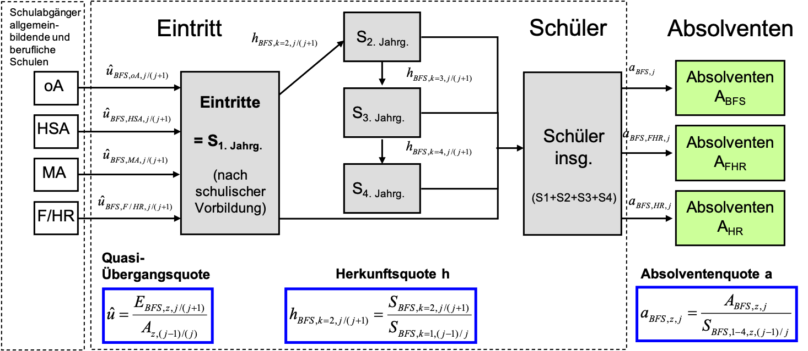  {#fig:Berufliche_Schulen_BFS}
Quelle: eigene Darstellung

### Abschlüsse an Schulen des Gesundheitswesens

#### Vorausberechnung der Schülerinnen und Schüler an den Schulen des Gesundheitswesens

In Nordrhein-Westfalen wird alle zwei Jahre mit der Landesberichterstattung Gesundheitsberufe ein aktuelles Fachkräftemonitoring für die Gesundheitsberufe in Nordrhein-Westfalen durchgeführt. Der letzte Bericht stammt aus dem Jahr 2019 und nutzt Daten aus dem Jahr 2017. Ein wesentliches Ergebnis des Berichts ist die Feststellung einer Mangelprognose pflegerischer Fachkräfte. Nach der Analyse fehlen für das Jahr 2018 insgesamt 10.000 Vollzeitkräfte. Im vorherigen Bericht betrug der Fehlbestand nur 2300 Vollzeitkräfte. 
Dies gilt für die qualifizierte dreijährigen Berufe der Altenpflege, der Gesundheits- und Krankenpflege sowie der Gesundheits- und Kinderkrankenpflege bei den ambulanten Diensten, teil/-vollstationäre Einrichtungen und Krankenhäuser [@MinisteriumfuerGesundheitArbeitundSozialesdesLandesNordrheinWestfalen.2019, S.2].
Der Anstieg wird vor allem durch die notwendige Ausweitung des Versorgungsangebotes der Einrichtungen der ambulanten und stationäre Pflege begründet. Eine Steigerung der Ausbildungszahlen konnte nur in der Ausbildung in der Altenpflege realisiert werden, in der Gesundhheits- und Krankenpflege und der Kinderkranbkenpflege stagnieren trotz steigendem Bedarf die Ausbildungszahlen.

Die verwendeten Daten basieren auf einer Erhebung an den Schulen des Gesundheitswesens, welche jährlich zum Stichtag 15.10. auf Basis einer freiwilligen Teilnahme an allen in NRW ansässigen Schulen des Gesundheitswesens erfolgt. Die Teilnahmequote liegt in der Regel bei 90 %. 

#### Methodik

Die Vorausberechnung der Schülerinnen und Schüler sowie der Absolventinnen und Absolventen an den Bildungsggängen an den Schulen des Gesundheitswesens erfolgt analog zu dem Vorgehen bei den beruflichen Schulen auf Ebene der Kreise. Zu unterscheiden sind 2 oder 3-jährige Bildungsgänge. Die Eintritte der erfolgen über Quasi-Übergangsquoten nach schulischer Vorbildung, wobei ein Hauptschulabschluss als Mindestvoraussetzung gilt. An den Schulen des Gesundheitswesens kann kein zusätzlicher allgemeinbildender Abschluss erworben werden, sodass nur die Quote der erfolgreichen Absolventinnen und Absolventen für die Abgänger relevant sind.      

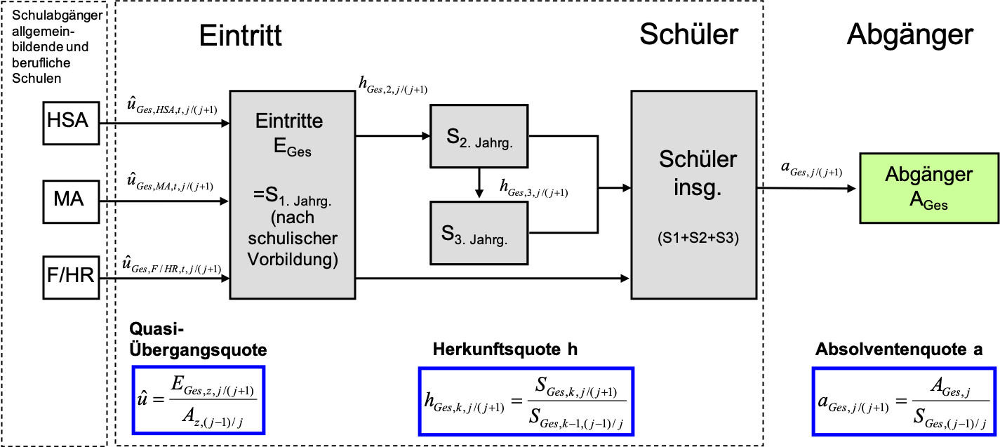  {#fig:Gesundheitsschulen}

Quelle: eigene Darstellung


##### Ergebnisse

<!-- ##### Schülerzahlen  -->
<!-- ##### Absolventen mit Bildungsabschlüssen -->


## Tertiärbereich

### Aufstiegsfortbildung

Im Anschluss an eine abgeschlossene Berufsausbildung kann eine *höherqualifizierende Berufsbildung* in Form einer *Aufstiegsfortbildung* erlangt werden. Die Aufstiegsfortbildung soll Absolventinnen und Absolventen der Berufsausbildung Führungskenntnisse- und Fähigkeiten vermitteln. Strukturell ist sie ähnlich angelegt wie eine duale Berufsausbildung. Während der betrieblichen Tätigkeit werden theoretische Kenntnisse vertieft und mit der Praxis verknüpft [@Ballauf.2011, S.7]. Als Zulassungsvoraussetzung für eine Aufstiegsfortbildung gilt in der Regel eine abgeschlossene Berufsausbildung und zusätzliche einschlägige Berufserfahrung. Als Abschlüsse werden in Deutschland vor allem  Meisterinnen und Meister und Technikerinnen und Techniker sowie kaufmännische Fortbildungsabschlüsse wie Betriebs- und Fachwirte und Fachwirtinnen erzielt. Die Prüfungsanforderungen werden in den Fortbildungsordnungen nach § 53 Berufsbildungsgesetz (BBiG) und § 42 Handwerksordnung (HwO) geregelt. 

Das Berufsbildungsgesetz (BBiG) in seiner Novellierung vom Mai 2020 sieht drei aufeinander aufbauende Fortbildungsstufen der höheren Berufsbildung vor, zunächst die Fortbildungsstufe der geprüften Berufsspezialistin und des Berufsspezialisten[^Berufsspezialisten] (z.B. für Servicetechnik), anschließend die Fortbildungsstufe der Bachelor Professional (z.B. in Bilanzbuchhaltung) und abschließend die Fortbildungsstufe der Master Professional (z.B. in Betriebswirtschaft). Bachelor Professional und Master Professional werden in der KldB keinem Anforderungsniveau zugeordnet. Für die Vorausberechnung ergibt sich für die Fortbildungsstufe Berufsspezialistin bzw. Berufsspezialist und dem Bachelor Professional das Anforderungsniveau 3, also das des Spezialisten. Der Master Professional führt zum Anforderungsniveau eines Experten. Da laut Statistischem Landesamt IT.NRW die Fallzahlen hier aber äußerst gering sind, gibt es derzeit keine statistische Erhebung für die Aufstiegsfortbildung zum Master Professional. Im Rahmen unserer Studie wird daher auch auf eine Fortschreibung dieser Fälle verzichtet.   

[^Berufsspezialisten]: Um den Status der geprüften Berufsspezialistin bzw. des geprüften Berufsspezialisten zu erwerben, muss die Prüfung der ersten beruflichen Fortbildungsstufe bestanden werden. Der Lernumfang der Fortbildungsstufe 1 umfasst mindestens 400 Stunden, im Regelfall werden diese dual neben der Berufstätigkeit ausgeführt (BBiG § 53b). Inhaltlich werden auf den in der Berufsausbildung erworbenen Fertigkeiten, Kenntnissen und Fähigkeiten vertieft und erweitert. Die berufliche Handlungsfähigkeit wird um neue Fertigkeiten, Kenntnissen und Fähigkeiten ergänzt BBiG § 53b). Eine Aufstiegsfortbildung kann in diversen Institutionen abgehalten werden, dazu gehören Fachschulen, die jeweiligen Industrie- und Handelskammern, Handwerkskammern, Ärztekammern oder Landwirtschaftskammern. Insgesamt gibt circa 90 Rechtsverordnungen und etwa 300 Regelungen der zuständigen Stellen bzw. Kammern [@Ballauf.2011, S.10].


#### Vorausberechnung der Teilnehmerinnen und Teilnehmer an einer Aufstiegsfortbildung bis 2040 

Die Vorausberechnung der Aufstiegsfortbildung basiert auf Bestandsgrößen der Berufsbildungsstatistik von IT.NRW und erfolgt auf Kreisebene. In Abbildung \@ref(fig:Aufstiegsfortbildung) sind die für die Vorausberechnung notwenigen zeitlichen Abläufe dargestellt. Die Auszubildenden absolvieren zunächst am Berufskolleg eine 2, 3 oder 4-Jährige Berufsausbildung. Im Anschluss daran und nach Aneignung von Berufserfahrung kann eine Aufstiegsfortbildung von der Fachkraft zum Spezialisten absolviert werden. Um den Anteil der Personen, welche nach bestandener Berufsausbildung anschließend eine Aufstiegsfortbildung absolvieren, abschätzen zu können, werden für verschiedene Jahre (2008 bis 2019) die Berufsbildungsstatistiken von IT.NRW ausgewertet. Es zeigt sich, dass im Mittel jährlich 18 % derjenigen, die eine berufliche Ausbildung abgeschlossen haben auch eine Aufstiegsausbildung abschließen.[^Aufstiegsausbildung]

[^Aufstiegsausbildung]: Um die Stabilität dieses Anteils zu prüfen, wurde für jedes Jahr die Gesamtanzahl an bestandenen Prüfungen für Berufsausbildungen und Aufstiegsfortbildungen in den Datensatz mit aufgenommen (mit Ausnahme von 2008 als die Aufstiegsfortbildungen noch nicht erfasst worden sind). Es wurde hierbei als zeitlicher Mindestabstand zwischen der abgeschlossenen Fortbildung und der abgeschlossenen Berufsausbildung 2 Jahre und einen maximalen Abstand von 8 Jahren festgelegt. Für jedes Jahr wurde im betrachteten Zeitraum die Anzahl der abgeschlossenen Berufsausbildungen in Relation zu der Anzahl der abgeschlossenen Aufstiegsfortbildungen in nachfolgenden Jahren mit mindestens 2 Jahren und maximal 8 Jahren Verzug gesetzt. Für jede der so erstellten 7 Verzugs-Variablen (2 Jahre Verzug bis 8 Jahre Verzug) wurde dann ein entsprechender Mittelwert berechnet. Bei einem 8 Jahres Verzug, würden z.B. 18,0 % der Personen mit einer abgeschlossenen Ausbildung nach 8 Jahren eine Aufstiegsfortbildung abschließen, für die 3 Jahres Verzüge bis zu den 7 Jahres Verzügen würde der Anteil jeweils 17,9% betragen, bei einem 2 Jahres Verzug 17,4 %. 

Der zeitliche Verzug zwischen dem Abschluss einer Berufsausbildung und dem Abschluss einer Aufstiegsfortbildung lässt sich empirisch aus den Daten der Berufsbildungsstatistik abschätzen. So zeigen unsere Auswertungen, dass signifikante Änderungen bei der Anzahl an abgeschlossenen Ausbildungen sich nach einer gewissen Zeit auch in ähnlich starken Änderungen bei den abgeschlossenen Aufstiegsfortbildungen zeigen. In den Jahren 2010 und 2011 gab es z.B. einen deutlichen Anstieg bei den abgeschlossen Berufsausbildungen, dieser Anstieg zeigte sich auch später bei den bestandenen Aufstiegsfortbildungen für die Jahre 2016 und 2017. Der empirische Befund legt nahe, dass es sinnvoll ist, für den zeitlichen Verzug zwischen einer abgeschlossenen Berufsausbildung und einer abgeschlossenen Aufstiegsfortbildung von einem Wert von sechs Jahren auszugehen. Für die Vorausberechnung werden zunächst alle Absolventinnen und Absolventen einer Berufsausbildung eines Jahres in den Fachkräftebestand eingeordnet. Sechs Jahre später wird von den neu eingetretenen *Fachkräften* der empirisch ermittelte Anteil derjenigen abgezogen, die eine Aufstiegsfortbildung absolviert haben und nun *Spezialisten* sind. Oder anders ausgedrückt: Dem Bestand der Fachkräfte zum Zeitpunkt $t$ wird also der Bestand der Aufstiegsfortbildung $t - 6$ abgezogen und dem Bestand der Spezialisten zum Zeitpunkt $t$ hinzugefügt. 

Für die Vorausberechnung muss auch das Alter für die spätere *Verrentung* berücksichtigt werden. Der vorrausberechnete Bestand der Fachkäfte und Spezialisten wird deshalb in die Altersgruppen *15-25 Jahre*, *26-40 Jahre*, *41 bis 55 Jahre* und *56-70 Jahre* eingeteilt. Die Absolventinnen und Absolventen einer Berufsausbildung werden zunächst als Eintritte in die Altersgruppe *15-25 Jahre* gewertet. Nach jedem Jahr wechselt dann ein Teil einer jeden Altersguppe zur nächst höheren Altersgruppe, bzw. ein Teil der Altersgruppe *56-70 Jahre* wird ausscheiden und in Rente gehen. Der Bestand an Fachkräften und Spezialisten setzt sich in den verschiedenen Altersgruppen dann aus dem Vorjahres-Bestand zusammen, zuzüglich der Neueintritte in den Bestand des aktuellen Jahres (für die Altersgrupppe 26-40 wären das alle die im Vorjahr 25 Jahre alt waren) und abzüglich der Austritte (Altersgruppe 26-40: 40-Jährige aus dem Vorjahr).[^AltersgruppeSpezialisten]

[^AltersgruppeSpezialisten]: Auch hier muss dem Bestand der Fachkräfte zum Zeitpunkt $t$ 18% der Eintritte zum Zeitpunkt $t-6$ abgezogen und dem Bestand der Spezialisten zugefügt werden. Dabei wird nur ein bestimmter Anteil noch in der selben Altersgruppe verbleiben. Fachkräfte, die eine Aufstiegsfortbildung absolvieren, und zum Zeitpunkt des Eintritts in Altersgruppe *15-25 Jahre* 20 Jahre oder älter sind, werden nach 6 Jahren nicht in den Bestand der Fachkräfte *26-40 Jahre* eintreten, sondern dem Bestand der Spezialisten der Altersgruppe *26-40 Jahre*. Das bedeutet, dass 18 % der Eintritte der Fachkräfte der Altersgruppe *15-25 Jahre*, welche 20 bis 25 Jahre alt sind, 6 Jahre später dem Bestand der Spezialisten der Altersgruppe *26-40 Jahre* zugeordnet werden. Gleichzeitig werden 18 % der Eintritte der Fachkräfte der Altersgruppe *15-25 Jahre*, welche 15 bis 19 Jahre alt sind, 6 Jahre später dem Bestand der Spezialisten der Altersgruppe *15-25 Jahre* zugeordnet.

```{r Aufstiegsfortbildung, fig.cap = "Vorausberechnungsmodell der Teilnehmer an einer Aufstiegsfortbildung"}
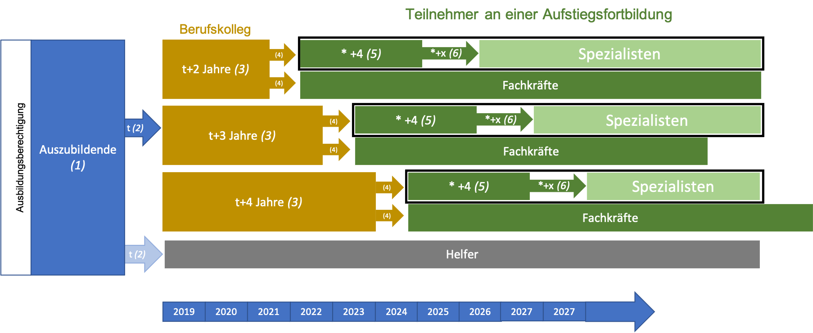
```


<!-- #### Vorausberechnung der erworbenen Abschlüsse bis 2040 -->

### (Fach-)Hochschulbildung

Die Vorausberechnungen im Hochschulbereich sind im Vergleich zu den Vorausberechnungen der Schülerinnen und Schüler im allgemeinbildenden Schulbereich mit größerer Unsicherheit  versehen, da sich in diesem Bereich individuelle Wahlentscheidungen stärker auswirken. 

#### Vorausberechnung der Studierenden bis zum Jahr 2040

Für die Vorausberechnung wurden die relevanten Parameter wieder aus dem veröffentlichten Datenmaterial abgeleitet. So wird die Studienanfängerquote aus den bedingten Übergangsquoten der Kultusministerkonferenz abgeleitet [@Kultusministerkonferenz.2019]. Für die Jahre 2015 bis 2017 werden die hier bereitgestellten Übergangsquoten der Absolventinnen und Absolventen mit allgemeiner/fachgebundener Hochschulreife und Fachhochschulreife in Abhängigkeit von der Übergangszeit genutzt. Die Tabelle \@ref(tab:studienanfaengerNachSchulabschluss) zeigt die für die Jahre 2015 bis 2017 gemittelten bedingten und absoluten Übergangsquoten für die Absolventinnen und Absolventen mit allgemeiner und fachgebundener Hochschulreife sowie Fachhochschulreife. Von den Studienberechtigten mit Hochschulreife in NRW der Jahre 2015-2017 nahmen durchschnittlich 48.2 % im Jahr des Erwerbs der Hochschulzugangsberechtigung (HZB) ein Studium auf. Von den Übrigen, die bis dahin noch kein Studium aufgenommen hatten, nahmen durchschnittlich 41.2 % im Jahr nach Erwerb der HZB ein Studium auf. Da in unserer Vorausberechnungen Hochschulen und Fachhochschulen nicht getrennt betrachtet werden, werden die Übergänge nach der Gesamtanzahl der Studienanfängerinnen und -anfänger an den Hochschulen (58,1 %) und Fachhochschulen (41,9 %) gewichtet und gemittelt.

```{r studienanfaengerNachSchulabschluss, echo=FALSE, tab.cap = "Studienanfänger nach Schulabschluss"}
tab_stud <- data.frame(
                   Absolventen.mit = c("Hochschulreife","Hochschulreife","Fachhochschulreife","Fachhochschulreife","gewichtetes Mittel"), 
                   Übergangsquoten.2015.2017 = c("bedingt","absolut","bedingt","absolut","absolut"),
                   im.gleichen.Jahr = c(48.2,48.2,49.9,49.9,48.9),
                    ein.Jahr = c(41.2,21.4,38.4,19.2,20.5),
                    zwei.Jahre = c(16.7,5.1,20.9,6.5,5.7),
                    drei.Jahre = c(20.3,5.1,19.4,4.7,5.0),
                    vier.Jahre.. = c(11.5,2.3,9.5,1.9,2.1),
                    Anteil = c("",58.1,"",41.9,""),
                   Insgesamt = c("",82.1,"",82.2,82.2))

library(flextable)
#library(officer)
ft <- flextable(tab_stud, defaults = TRUE)
ft <- set_header_labels(ft, Absolventen.mit = "Absolventen mit", Übergangsquoten.2015.2017 = "Übergangsquoten 2015-2017",im.gleichen.Jahr = "im gleichen Jahr", ein.Jahr = "ein Jahr", zwei.Jahre="zwei Jahre",drei.Jahre = "drei Jahre", vier.Jahre.. = "vier Jahre +",Anteil ="Anteil an allen Studienanfänger",Insgesamt="Studienanfänger insg.")
ft <- align_text_col(ft, align = "left")
ft <- align_nottext_col(ft, align = "right")

ft <- footnote(ft, i = c(1,3), j = 1,
            value = as_paragraph(
              "Daten aus Kultusministerkonferenz (2019)"),
#            ),
            ref_symbols = "a", inline = T)
#            part = "header")


ft <- footnote(ft, i = c(2,4,5), j = 1,
            value = as_paragraph(
              "Eigene Berechnung"),
#            ),
            ref_symbols = "b" , inline = T)
#            part = "header")

ft
```

#### Methodik


Das Schaubild \@ref(fig:Hochschulen) zeigt das methodische Vorgehen bei der Vorausberechnung. Absolventen der allgemeinbildenden Schulen und Berufskollegs mit  Hochschul- und Fachhochschulberechtigung (1), nehmen zu einem bestimmten Anteil (3) ein Studium auf (2). Die Hochschulanfängerquote[^hoanquo] liegt im Mittel bei ca. 82 %. 

[^hoanquo]: Der Anteil der Studienanfänger von Allgemeinbildenden Schulen und von Berufskollegs stammt aus der 21. Sozialerhebung des DZHW. Für die 21. Sozialerhebung wurden 2016 im Zuge einer standardisierten Querschnittserhebung in 248 deutschen Hochschulen 55.211 studierende Deutsche und Bildungsinländer/innen sowie 3.586 Bildungsausländer/innen online zu Themen wie unter anderen die Studienmerkmale und den Hochschulzugang oder auch die soziale Zusammensetzung der Studierenden befragt. Für unsere Analyse sind vor allem der *Weg zum Erwerb der Studienberechtigung* und das Bundesland, in dem die Studienberechtigung erworben worden ist von Interesse, um den Anteil der Studienanfänger/innen zu ermitteln, welche ihre Studienberechtigung an einem Berufskolleg erworben haben. An Allgemeinbildenden Schulen liegt der Anteil bei 82,4 %, bei Berufskolleg bei 17,6 %.


```{r Hochschulen, fig.cap = "Hochschulen. Quelle: Eigene Darstellung"}
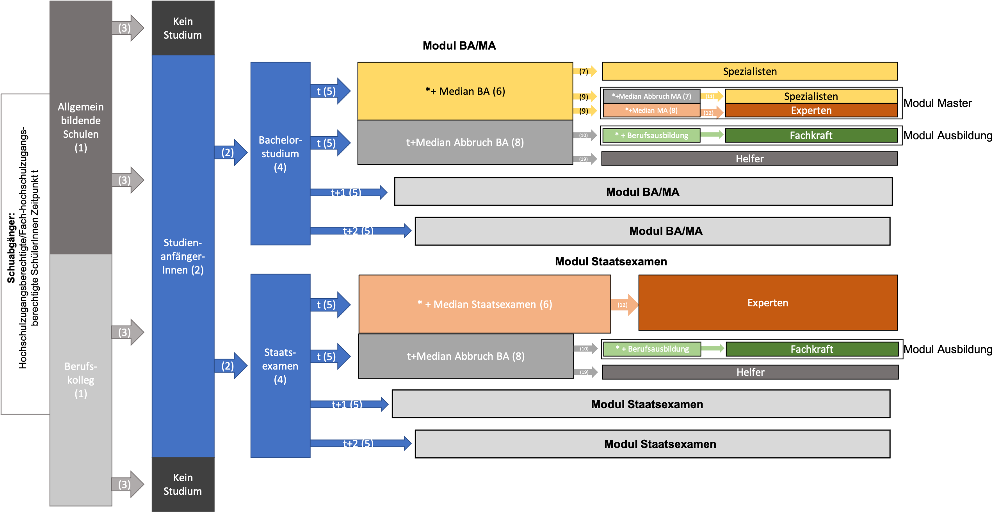
```

In der Vorausberechnung wird strukturell zwischen zwei prinzipiellen Studienmöglichkeiten (4) unterschieden. Studierende haben entweder die Möglichkeit mit einem Bachelor/Master oder einem Staatsexamen abzuschließen. Der Anteil der Studierenden, die den Weg des Staatsexamens wählen ist im Vergleich relativ klein und liegt im Durchschnitt bei XXX %. 

Für die durchschnittliche Dauer bis zum Studienbeginn (5) werden die Daten aus Tabelle \@ref(tab:studienanfaengerNachSchulabschluss) zugrundegelegt. Für die Vorausberechnung der Abschlüsse ist die zeitliche Verzögerung bis zur Aufnahme eines Studiums wichtig, da nur knapp 50 % der Studierenden in dem Jahr des Erwerbs der Hochschulzugangsberechtigung direkt ein Studium aufnehmen. Das Schema zeigt dann den weiteren Studienverlauf und die erreichbaren Qualifikationsniveaus. Ein Bachelor Erststudium oder Staatsexamen wird eventuell abgebrochen (8) und stattdessen eine Berufsausbildung (10) mit der späteren Qualifikation als *Fachkraft* angeschlossen. Ohne weitere (Berufs)ausbildung verbleibt man auf dem Qualifikationsniveau eines *Helfers*. Wenn das Bachelor-Studium erfolgreich abgeschlossen wird (7), wird man *Spezialist*. Ein großer Teil der erfolgreichen BA-Absolventen nehmen im Anschluss ein Masterstudium auf und qualifizieren sich dann bei erfolgreichem Abschluss (12) zu einem *Experten*. Der Studienverlauf des Staatsexamen-Moduls ist analog dem Master strukturiert, es fehlt nur der Zwischenschritt eines Bachelorstudiums.  

Die durchschnittlichen Erfolgsquoten bzw. Abbruchquoten für ein Bachelor Studium und ein Staatsexamen und stammen aus den Veröffentlichungen des Deutsches Zentrum für Hochschul- und Wissenschaftsforschung [@Heublein.2020]. Das Statistische Landesamt NRW (IT.NRW) stellte zudem Daten zu den bestandenen Prüfungen und der Studiendauer in NRW unterteilt nach Prüfungsgruppen zur Verfügung. Aus diesen Daten konnte der Median für die Fachstudiendauer bis zum bestandenen Bachelor/Staatsexamen/Master ermittelt werden (6 und 7).

Die Median Dauer bis zum Abbruch eines Bachelors- oder Mastertudiums bzw. Staatsexamen ist schwieriger zu ermitteln. Diese Daten stammen aus einer Untersuchung von @Heublein.Juni2017.[^UHeuble] 

[^UHeuble]: Sie untersuchten Ursachen des Studienabbruchs, den beruflicher Verbleib der Studienabbrecherinnen und Studienabbrecher und die Entwicklung der Studienabbruchquote an deutschen Hochschulen. Die Daten basieren auf einer repräsentativen Klumpenstichprobe, es wurden 6.029 Exmatrikulierte in Zeitraum von 2014 und 2016 (Exmatrikulierte des Sommersemesters 2014) an 32 Universitäten und 28 Fachhochschulen befragt.


#### Ergebnisse

<!-- Entwicklung der Studierenden -->
<!-- Entwicklung der Studienabschlüsse -->


# Qualifikationsnachfrage

Angesichts der demografischen Entwicklung sind Arbeits- und Fachkräfteengpässe zumindest in einigen Regionen und Berufen in Deutschland zu erwarten. Arbeitskräfteengpässe zeichnen sich dadurch aus, dass die Nachfrage nach Arbeitskräften generell oder in bestimmten Berufen durch das Angebot an Arbeitskräften nicht gedeckt werden kann. Von einem Fachkräfteengpass spricht man, wenn die Nachfrage an Arbeitskräften mit bestimmten benötigten Qualifikationen das Angebot übersteigt [vgl. @BIBB.16.08.2021]. 
In der Arbeitswelt lassen sich auf Basis von verschiedenen Studien einige Trends skizzieren.

## Trends in der Arbeitswelt

Das Bundesinstitut für Bildung (BIBB) sagt voraus, dass sich in Zukunft Engpässe auf dem Arbeitsmarkt verschärfen werden. Die geburtenstarken Jahrgänge 1950-1965, die über eine abgeschlossene Berufsausbildung verfügen, werden in den kommenden zwanzig Jahren aus dem Arbeitsleben ausscheiden und durch deutlich schwächere Geburtenjahrgänge ersetzt. In den letzten Jahren zeichnet sich insbesondere ein Rückgang der neu abgeschlossenen Ausbildungsverträge ab.

### Rückgang der neu abgeschlossenene Ausbildungsverträge 

* Seit dem Jahr 2008, dem Jahr der internationalen Finanzkrise, sind die Zahlen der neu abgeschlossenen Ausbildungsverträge bundesweit stark zurückgegangen. Damals sank innerhalb eines Jahres das Ausbildungsplatzangebot um 8,5 % und die Ausbildungsplatznachfrage um 8,3 %. Die Zahl der neuen Ausbildungsverträge nahm um 8,4 % ab. Der starke Einbruch hielt auch nach der Finanzkrise an [vgl. @Oeynhausen.2020, S. 3]. Der Rückgang wurde vor allem als Folge sinkender Schulabgängerzahlen angesehen, zudem konnte man zum Schluss auch nicht mehr von einer weiter steigenden Ausbildungsbeteiligung Geflüchteter ausgehen [vgl. @Oeynhausen.2020, S. 2]. 

* Der rückläufige Trend zeigte sich auch in Nordrhein-Westfalen. Im Jahr 2010 gab es 124.224 Auszubildende mit neu abgeschlossenen Ausbildungsverträgen (im Jahr). Diese Zahl reduzierte sich bis zum Jahr 2019 um 6,9 % auf 115.671. Im Jahr 2020 lag sie dann nur noch bei 103.188, dies ist ein erneuter Rückgang um 10,8 % [vgl. @InformationundTechnikNordrheinWestfalen.Juni2021]. Ein Teil davon ist allerdings vermutlich auch der Covid-19-Pandemie und den wirtschaftlichen Folgen der Eindämmungsmaßnahmen geschuldet [vgl. @Oeynhausen.2020, S. 2]. 

* Eine Ursache ist darin zu sehen, dass sich junge Erwachsene immer seltener für eine klassische Berufsausbildung sondern zunehmend *für ein Studium entscheiden*, so dass insbesondere im mittleren Qualifikationsbereich mit Arbeitskräftelücken zu rechnen sei.  Hinter der Entscheidung gegen eine Berufsausbildung wird auch ein Reputations- bzw. Imageproblem der Ausbildung gesehen [vgl. @Granato.2018]. 

* Ein weiterer Aspekt sind *Passungsprobleme* auf dem Ausbildungsmarkt, sie haben auch in Nordrhein-Westfalen zugenommen. Eine Analyse der Passungsprobleme zeigt, dass sie weniger durch mangelnde regionale Mobilität entstehen. Viel eher ignorieren die Jugendlichen infolge ihrer teilweise stark gestiegenen schulischen Vorbildung zunehmend Ausbildungsangebote in typischen *Hauptschülerberufen*, in ihren Wunschberufen gibt es jedoch zu wenig Ausbildungsplätze [vgl. @Granato.2018].
Granato et al. (2018, S.1) verweisen darauf, dass zwischen 2009 und 2017 die Zahl der unbesetzen Ausbildungsplätze in NRW von 2400 auf 7500 angestiegen sind. Gleichzeitig lag der Umfang der erfolglosen Ausbildungsplatznachfrage mit über 20.000 auf konstant hohem Niveau. Um diese Passungsprobleme zu verringern plädieren sie insbesondere dafür, dass die Attraktivität von Berufen mit Besetzungsproblemen gesteigert werden muss. Hierzu gehört auch, dass die Ausbildungs- und Arbeitsbedingungen sowie die Einkommensmöglichkeiten stärker an die Verhältnisse in den sonstigen Berufen angepasst werden muss.

<!-- SJ: Gibt es auch was zu fehlender höherer Qualifikation? -->
### 


## Zukünftige Nachfrage nach Qualifikationen verändert sich (qualitative Szenarien der exogenen Trendentwicklung)

* Die grundlegenden exogenen Faktoren der Arbeitsmarktentwicklung sind der Klimawandel und die  Globalisierung sowie der technologische und demografische Wandel [@Cedefop.2008, S. 17]. 

* Studien beschreiben Ressourcenknappheit und steigende Preise als "Megatrend" der wirtschaftlichen Entwicklung [@Zika, Maier. 2015, S. 71-76]. Steigende Energiepreise werden Anreize für Innovationen zur Steigerung der Energieeffizienz setzen und so die Energiewende vorantreiben [@Bundesministerium für Arbeit und Soziales.2013, S. 21-22].

* Technologische Fortschritte auf den Gebieten der Robotik, der künstlichen Intelligenz sowie der Ausbau der digitalen Infrastruktur ermöglichen eine zunehmende Automatisierung von Tätigkeiten. In der Literatur zum Thema Automatisierung werden zwei gegenläufige Trends beschrieben: 

** Einerseits bieten sich neue Produktionsmöglichkeiten, wovon Berufe in der Fertigung und Entwicklung von Technologie profitieren und neue Arbeitsplätze entstehen werden [@WernerEichhorst.2015, S. 2-5]. Es ist jedoch fraglich, ob Deutschlands Industrie am Wachstum in der Produktion informationstechnischer Güter teilhaben wird. Das Bundesministerium für Arbeit und Soziales geht davon aus, dass das produzierende Gewerbe zunehmend nach Indien und China abwandert und deutsche Unternehmen vermehrt auf technische Dienstleistungen setzen werden [@Bundesministerium für Arbeit und Soziales.2013, S. 21-22]. Komparative Vorteile der deutschen Wirtschaft lägen in wissensbasierten Dienstleistungen und der Entwicklung [@Bundesministerium für Arbeit und Soziales.2013, S. 21-22]. Ein Strukturwandel hin zu technischen Dienstleistungen und einem Fokus auf die Entwicklung neuer technischer Lösungen geht einher mit einem Tätigkeitswandel und einer Veränderung der Qualifikationsanfordeung steigenden Anteil an Fachkräften und wissensintensiven Tätigkeiten [@WernerEichhorst.2015, S. 2-5]. Als Gegenargument wird angebracht, dass die Produktivitätszuwächse zu niedrigeren Preisen führen, was wiederum die Konsumnachfrage steigern und letztlich die Rückverlagerung von Produktionsprozessen aus Niedriglohnländern ermöglichen könnte [@Arntz et al.. 2018, S. 1]. Das Institut für Arbeitsmarkt und Berufsforschung IAB und das Bundesinstitut für Berufsbildung (BIBB) beobachteten eine Verlangsamung des Beschäftigungsabbaus in der Industrie, sodass nicht von einer Abkehr des bisherigen Wirtschaftsmodells gesprochen werden könne [@Zika.2015, S. 71-76]. Sofern neue Märkte und ausreichend Beschäftigungsmöglichkeiten entstehen, führen neue Technologien nicht zwangsläufig zu einem Beschäftigungsrückgang [@Arntz et al.. 2018, S. 1]. 

** Andererseits werden Substitutionsprozesse und eine zunehmende Konkurrenz von Arbeit und Kapital prognostiziert. Während in der Vergangenheit primär die Automatisierung der industriellen Produktion beobachtet werden konnte, wird für die Zukunft eine Ausweitung des Automatisierungstrends auf den Dienstleistungssektor erwartet [WernerEichhorst.2015, S. 2-5]. Technologische Entwicklungen wie autonom fahrende Autos und Sprach-Roboter in der Beratung können in Zukunft bestimmte Nicht-Routinetätigkeiten übernehmen [ebd.]. Verwaltungsintensive Sektoren wie der Handel, das Verlagswesen und die Medien bieten besonders große Automatisierungspotenziale [@Bundesministerium für Arbeit und Soziales.2013, S. 21-22]. Es bestehe die Gefahr der "Entwertung" von Qualifikationen durch die zunehmenden Automationspotenziale auch komplexer Tätigkeiten [@Amlinger.Juni2017, S. 38]. Unter dem Begriff des *polarisierten Upgradings* werden Szenarien beschrieben, in denen Tätigkeiten des mittleren Anforderungsniveaus (z.B. Schreiben, Rechnen, Buchhaltung und Recherche) von technischen Lösungen übernommen werden und vorrangig die Arbeitsnachfrage nach ungelernten und hoch qualifizierten Kräften verbleibt [@Helmrich.2016, S. 10]. Zukünftig sei es weniger entscheidend, ob Tätigkeiten manuell, interaktiv oder analytischer Natur sind, sondern lediglich der Grad ihrer Programmierbarkeit [@MichaelTiemann.2016, S. 1-5].

** Neben der Polarisierungsthese bezeichnet der *Kaminzug-Effekt* ein alternatives Szenario der technologisch induzierter Veränderungen der Qualifikationsnachfrage. Wie bei der Polarisierungsthese führe der strukturelle wandel mit Fokus auf wissensintensive Arbeitsbreiche zwar zu einer Anhebung der Qualifikationsanforderungen, jedoch bedeute dies nicht zwangsläufig eine Aushöhlung des mittleren Qualifikationsniveaus. <!-- belegen -->

** Angesichts der wachsenden Komplexität vernetzter Entwicklungs- und Produktionsketten sehen sich angelernte, Fachkräfte und hoch qualifizierte Kräfte in der Industrie mit "deutlich erhöhte[n] Komplexitäts-, Problemlösungs-, Lern- und vor allem auch Flexibilitätsanforderungen" konfrontiert [@PeterIttermann.2015, S. 47-50]. 

--> Weiter schreiben

* Der demografische Wandel äußert sich zum einen in einer alternden Bevölkerung und zum anderen in einer schrumpfenden Gesamtbevölkerung. Es wird erwartet, dass der Bevölkerungsrückgang zu weniger Nachfrage in den Sektoren der Bauwirtschaft, dem Wohnungswesen und dem Erziehungswesen sowie zu einer sinkenden Nachfrage nach anderen öffentlichen Dienstleistungen führen wird [@Bundesministerium für Arbeit und Soziales.2013, S. 21-22]. So sind die staatlichen Konsumausgaben für das Bildungswesen abhängig von der Zahl der Kinder. Die Anzahl privater Haushalte wirkt sich auf den Fahrzeugbestand und die Wohnungsbauinvestitionen aus [@Zika.2015, S. 71-76]. Durch den wachsenden Anteil der Bevölkerungsgruppen über 60 ist von einer zunehmenden Nachfrage nach Pflege- und Gesundheitsdiensten auszugehen [@Bundesministerium für Arbeit und Soziales.2013, S. 21-22], was eine Ausweitung der Nachfrage nach Fachkräften auf mittlerem und hohem Qualifikationsniveau mit sich bringen würde [WernerEichhorst.2015.2015, S. 2-5].

*Globalisierung
IZA: Triebkräfte der Entwicklung der Arbeitswelt & Arbeitsmarktes

## endogene Einflussgrößen auf die Arbeitsnachfrage

Zuwanderung
wirtschaftlicher Strukturwandel
Qualifikationsstrukturen
Lohn- und Arbeitszeitentwicklung
[@Maier.2014, S. 7]

# Exkurs: Probleme und Anmerkungen
## Nachfrage- und angebotsinduzierte Effekte
Nachfrage- und angebotsinduzierte Effekte sind in der Praxis oft schwer zu differenzieren. Dies veranschaulicht Das Europäische Zentrum für die Förderung der Berufsausbildung (Cedefop) in einem Beispiel: Angenommen der Anteil der Erwerbstätigen der höheren Anforderungsniveaus in einem Berufsbereich steigt, so könnte dies zum einen auf erhöhte Qualifikationsanforderungen zurückzuführen sein. Andererseits wäre es jedoch genau so gut denkbar, dass die Qualifikationsanforderungen unverändert sind, sich aber das Qualifikationsangebot verändert hat. Ist das Qualifikationsangebot besser qualifiziert werden schlechter qualifizierte Bewerbe unabhängig vom Nachfragedruck verdrängt [@Cedefop. 2018, S. 71]. Eine solche Bildungsinflation kann als angebotsinduzierter Qualifikationswandel gesehen werden.

Bereits in den Ist-Daten bestehende Missverhältnisse zwischen Qualifikationsangebot und -nachfrage werden nicht erfasst. Überqualifikation, Arbeitslosigkeit und Fachkräftemangel können die Fortschreibungen verzerren.


## Vorausberechnung der Qualifikationsnachfrage

Basis für die Vorausberechnung der Qualifikationsnachfrage ist eine Klassifikation von Berufen. Die Bundesagentur für Arbeit hat in Zusammenarbeit mit dem Institut für Arbeitsmarkt- und Berufsforschung und unter Beirat des Arbeitskreises *Klassifikation der Berufe 2010* die für Deutschland aktuellste Klassifikation der Berufe entwickelt. Diese soll die Besonderheiten des deutschen Arbeitsmarktes erfassen aber gleichzeitig eine hohe Kompatibilität mit der internationalen Berufsklassifikation ISCO-08 aufweisen [@BundesagenturfurArbeit.28.09.2010, S. 4-5].


### KldB-Klassifikation

#### Berufsbereiche, Berufsfachlichkeit

Die Klassifikation der Berufe 2010 strukturiert Berufe anhand zweier Dimensionen. Die primäre Dimension stellt die *Berufsfachlichkeit* als horizontale Dimension dar. Mit ihr werden Berufe nach ihren benötigten Fachkompetenzen und einhergehenden Tätigkeiten gruppiert [@BundesagenturfurArbeit.28.09.2010, S. 7, @BundesagenturfurArbeit.15.03.2011, S. 1].
Diese Dimension umfasst insgesamt vier Gliederungsebenen. Die erste Ebene der Klassifikation der Berufe 2010 besteht aus 10 Berufsbereichen (1-Steller). Diese Berufsbereiche werden in der zweiten Ebene in 37 Berufshauptgruppen (2-Steller) unterteilt, in der dritten Ebene in 144 Berufsgruppen (3-Steller) und in 700 Berufsuntergruppen (4-Steller) in der vierten Ebene [@BundesagenturfurArbeit.15.03.2011, S. 1-2].

Die Tabelle \@ref(tab:kldbBereich) gibt einen Überblick über die Berufsbereiche (1-Steller) der KldB 2010.

```{r kldbBereich, echo=FALSE, tab.cap = "Berufsbereich der KldB 2010 [@BundesagenturfurArbeit.15.03.2011, S. 1]"}
tab_kldb_bereich  <- data.frame(Schlüssel = c(1:9,0), 
                   Langfassung = c("Land-, Forst- und Tierwirtschaft und Gartenbau",
                                   "Rohstoffgewinnung, Produktion und Fertigung",
                                   "Bau, Architektur, Vermessung und Gebäudetechnik",
                                   "Naturwissenschaft, Geografie und Informatik",
                                   "Verkehr, Logistik, Schutz und Sicherheit",
                                   "Kaufmännische Dienstleistungen, Warenhandel, Vertrieb, Hotel und Tourismus",
                                   "Unternehmensorganisation Buchhaltung, Recht und Verwaltung",
                                   "Gesundheit, Soziales, Lehre und Erziehung",
                                   "Sprach-, Literatur-,Geistes-,Gesllschafts- und Wirtschaftswissenschaften, Medien, Kunst, Kultur und Gestaltung",
                                   "Militär"))
#kable(tab_kldb_bereich, caption = "Berufsbereich der KldB 2010 [@BundesagenturfurArbeit.15.03.2011, S. 1]")
ft <- flextable(tab_kldb_bereich, defaults = FALSE)
ft <- autofit(ft, add_w = 0.1, add_h = 0.1, part = c("body", "header"))


ft
```
    

#### Anforderungsniveaus nach KldB

Die zweite Dimension der Klassifikation der Berufe 2010 stellt das *Anforderungsniveau* eines Berufes dar. Diese Dimension weist eine vertikale Struktur auf, da die Anforderungsniveaus sich an der Komplexität der auszuführenden Tätigkeit richten und somit hierarchisch gegliedert sind [@BundesagenturfurArbeit.28.09.2010, S. 7]. Um die benötigten Qualifikationen für bestimmte Berufe zu differenzieren, wird die fünfte Ebene der Klassifikation der Berufe 2010 (KldB 2010) hinzugezogen. Die KldB-5-Steller repräsentieren die verschiedenen Berufsgattungen [@BundesagenturfurArbeit.15.03.2011, S. 1]. Als Kriterium dient u.a. die Dauer der beruflichen Ausbildung, die für die berufliche Tätigkeit vorausgesetzt wird, da der Komplexitätsgrad zumeist mit dem Anfordungsniveau steigt. 

Das Anforderungsniveau eines Berufes wird in die vier Ausprägungen "Helfer", "Fachkraft", "Spezialist" und "Experte unterteilt (s. Abbildung \@ref(fig:tab_kldb). Berufe, denen das *Anforderungsniveau 1* zugeordnet wird, sind weniger komplex und erfordern aus diesem Grund keine oder nur wenige spezifische Fachkenntnisse, dementsprechend ist kein beruflicher Bildungsabschluss erforderlich. Daher werden dem Anforderungsniveau 1 alle Helfer- und Anlerntätigkeiten sowie Tätigkeiten, welche eine einjährige Berufsausbildung voraussetzen [@BundesagenturfurArbeit.28.09.2010, S. 7-8]. Das Anforderungsniveau wird folgend als **Helfer** beschrieben.

Berufe, die in der Regel eine zwei- bis dreijährige Berufsausbildung erfordern, werden dem *Anforderungsniveau 2* zugeordnet. Die benötigten Kenntnisse sind komplexer und fachspezifischer als bei Helfer- und Anlerntätigkeiten [@BundesagenturfurArbeit.28.09.2010, S. 8]. Typisch sind berufsqualifiziernde Abschlüsse an einer Berufsfachschule. Sie entsprechen dem Komplexitätsgrad der Tätigkeit einer Fachkraft. Das Anforderungsniveau wird folgend als **Fachkraft** beschrieben.

Berufe mit dem *Anforderungsniveau 3* sind deutlich komplexer und umfassen Fach- und Führungsaufgaben sowie Planungs- und Kontrolltätigkeiten. Es werden Spezialkenntnisse und -fertigkeiten vorausgesetzt, welche durch eine berufliche Weiter- oder Fortbildung erworben wurden. Zum Anforderungsniveau gehören demnach Berufe, die beispielsweise eine Meister- oder Technikerausbildung oder einen gleichwertigen Fachschul - oder Hochschulabschluss benötigen. Als gleichwertig anzusehen sind Abschlüsse einer Fach- oder Berufsakademie, ein Abschluss an einer Fachschule oder ein Bachelorabschluss an einer Hochschule bzw. Fachhochschule [@BundesagenturfurArbeit.28.09.2010, S. 8-9]. Das Anforderungsniveau wird folgend als **Spezialist** beschrieben.

Das *Anforderungsniveau 4* wird hochkomplexen Berufen mit hohen Kenntnis- und Fertigkeitsniveau zugeschriebenen. Dies sind z.B. Berufe mit Entwicklungs-, Forschungs- und Diagnosetätigkeiten und Wissensvermittlung. Darüber hinaus fallen Leitungs- und Führungsaufgaben an, häufig in großen Unternehmen. Voraussetzung für einen solchen Beruf ist in der Regel ein Hochschulabschluss, welcher eine mindestens vierjährige Hochschulausbildung voraussetzt. Also ein Masterabschluss, Diplom, Staatsexamen o.ä. gegebenenfalls sogar eine Promotion bzw. Habilitation. Alternativ kann dieses Anforderungsniveau auch mit angemessener Berufserfahrung erlangt werden [@BundesagenturfurArbeit.28.09.2010, S. 9]. Das Anforderungsniveau wird folgend als **Experte** beschrieben.


```{r kldb1, echo=FALSE, tab.cap = "Übersicht Klassifikation der Berufe (Bundesagentur für Arbeit (2011, S.2)"}
tab_kldb <- data.frame(Anforderungsniveau = 1:4, 
                   Langfassung = c("Helfer- und Anlerntätigkeiten",
                                   "fachlich ausgerichtete Tätigkeiten",
                                   "komplexe Spezialistentätigkeiten",
                                   "hoch komplexe Tätigkeiten"),
                   Kurzfassung = c("Helfer", "Fachkraft", 
                                   "Spezialist", "Experte"))


ft <- flextable(tab_kldb, defaults = TRUE)
ft <- autofit(ft, add_w = 0.1, add_h = 0.1, part = c("body", "header"))
ft
```

Die Vorausberechnung stützt sich auf die Anforderungsniveaus. Diese sind Eigenschaften der Arbeitsstelle auf Seiten der Arbeitsnachfrage. Qualifikationen sind Eigenschaften der Erwerbstätigen und konzeptionell dem Arbeitsangebot zuzuordnen. Das Anforderungsniveau der Arbeitsstelle und die Qualifikation der Erwerbstätigen, die sie ausführen, müssen sich nicht entsprechen. Bei einem Angebotsüberhang oder bei komparativen Lohnvorteilen können Erwerbstätige ihre Arbeitskraft auch unterhalb ihres Qualifikationsniveaus anbieten. Bei einem Nachfrageüberhang könnten Unternehmen gezwungen sein, offene Stellen mit unterqualifizierten Arbeitnehmern zu besetzen. Letzteres wird vermutlich weniger häufig der Fall sein da die Ausfüllung der Arbeitsstelle mit bestimmten Anfordungsniveus verbunden ist. Für das im Anschluss durchgeführte Matching von Angebot und Nachfrage müssen Qualifikation und Anforderungsniveau zusammengeführt werden.

Analog der qualifikationsbezogenen Flexibilität ist es ebenfalls möglich, dass Arbeitnehmer aufgrund von bestimmten Arbeitsmarktkonstellationen die Branche bzw. die Berufsgruppe wechseln. Dies wird im Rahmen unserer Vorausberechnung nicht berücksichtigt, da in unserer Studie beim Matching von Angebot und Nachfrage nicht nach Berufsbereichen oder Branchen disaggregiert wird.


Die Vorausberechnung der Qualifikationsnachfrage erfolgt auf zwei Wegen...


### Vorausberechnung auf Grundlage des Mikrozensus


Die erste Vorausberechnung der Arbeitsnachfrage erfolgt disaggregiert nach 10 Berufsbereichen (KldB-2010 Einsteller), 4 Anforderungsniveaus (Endziffer des KldB-2010 Fünfstellers) und den drei Regionen. Sie basiert auf Erwerbstätigenzahlen am Arbeitsort der Mikrozensen 2013 und 2019. Die Mikrozensen vor 2013 können leider aufgrund inkompatibler Berufsklassifikationen nicht genutzt werden (hier wurde die KldB-92 statt KldB-2010 verwendet).


--> Mikrozensus-Datenbestellung 1b soll benutzt werden, um abzugleichen, welche Qualiifkatiosniveaus welche Anforderungsniveaus real ausführen. ANMERKUNG Mats 11.08.: Der 1b Datensatz ist meines Wissens nach von Simon bestellt, aber bisher noch nicht übermittelt worden.


Die Fortschreibung der Arbeitsnachfrage besteht aus drei Komponenten: der absoluten Arbeitsnachfrage nach Regionen, der Berufsstruktur und der Anforderungsstrukturen innerhalb von Berufsbereichen. Die Berufsstruktur und die Anforderungsstrukturen innerhalb der Berufsbereiche können nachfolgend genutzt werden, um die absolute Arbeitsnachfrage der Regionen weiter zu disaggregieren. Die Wachstumsfaktoren der Komponenten werden als multiplikative Größen konzipiert. 

ANMERKUNG Mats: Könnte es passieren, dass es zu Sprüngen in der Entwicklung der Arbeitsnachfrage kommt, wenn wir vom letzten Jahr des Ist-Stands (2019) zum ersten Jahr der Vorausberechnung (2020) übergehen?

### Komponente 3.1.1: Inter-Regionen Effekte
In Komponente 3.1.1 werden jährliche prozentuale Wachstumsfaktoren der absoluten Arbeitsnachfrage nach Regionen berechnet. Für jede Region werden die Erwerbstätigen des Jahres 2019 in das Verhältnis zu denen des Jahres 2013 gesetzt. Dieser Faktor bezieht sich auf das Wachstum über den Zeitraum von 6 Jahren und wird über die Zinseszinsformel in einen jährlichen Wachstumsfaktor überführt. Die Formel zur Berechnung der Erwerbstätigen des Jahres t in Region r lautet: 

Erwerbstätige_r_t = Erwerbstätige_r_t-1 * Wachstumsfaktor_r

Der multiplikative Wachstumsfaktor der Region bleibt für jedes Jahr der Vorausberechnung konstant.Das absolute Delta der Erwerbstätigen (Erwerbstätige_r_t-1 - Erwerbstätige_r_t-1) ergibt sich aus dem absoluten Niveau der Erwerbstätigkeit zum Zeitpunkt t-1.

```{r berechnungInterRegioneneffekt, fig.cap = "Berechnung Wachstumsfaktor absolute Arbeitsnachfrage nach Regionen"}
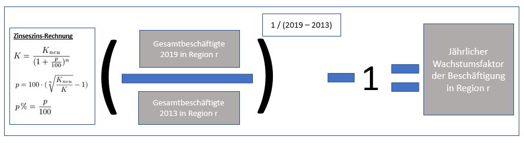
```

ANMERKUNG Mats: Diese Komponente könnte in die absolute Gesamtnachfrage in NRW und die relative Regionenstruktur unterteilt werden. Dies wäre insbesondere dann sinnvoll, wenn mit konstanten Erwerbstätigenzahlen gerechnet werden soll.

###Komponente 3.1.2: Inter-Berufsbereich Effekte
Komponente 3.1.2 berechnet die berufliche Struktur innerhalb der Regionen. Die Wachstumsfaktoren der Anteile der Berufsbereiche innerhalb der Regionen werden ebenfalls nach dem oben beschriebenen Zinseszins-Prinzip gebildet. Jeder Berufsbereich erhält einen eigenen Wachstumsfaktor, der die jährliche Veränderung des Anteils der Berufsgruppe abbildet. Die Berufstruktur, die sich aus den Anteilen der Berufsbereiche einer Region ergibt, kann mit der Zahl der Erwerbstätigen multipliziert werden, um letztere zu disaggregieren.

ANMERKUNG Mats: Könnte es passieren, dass die Anteile der Berufsbereiche so wachsen, dass sie in ihrer Summe nicht mehr 1 betragen? Falls ja, müssten die Anteile normiert werden: 
Anteil der Berufsgruppe <- Anteil der Berufsgruppe / sum(Anteile aller Berufsgruppen in Region)

```{r berechnungInterBerufsbereicheffekt, fig.cap = "Berechnung Wachstumsfaktor relative Anfoderungsstruktur nach Regionen"}
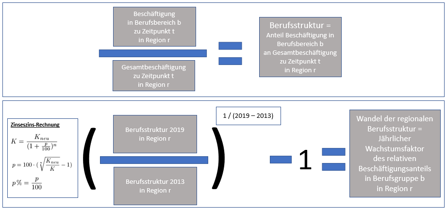
```

###Komponente 3.1.3: Inter-Anforderungseffekte
Komponente 3.1.3 beschreibt die Veränderung der Anforderungsstruktur innerhalb der Berufsbereiche nach Regionen. Für jeden Berufsbereich einer Region werden die Anteile der Anforderungsniveaus in 2013 und 2019 gebildet. Mithilfe der Zinseszinsformel können aus dem Verhältnis der Anteile des Anforderungsniveaus a in Berufsbereich b und Region r aus den Jahren 2019 zu den Anteilen aus 2013 jährliche Wachstumsfaktoren gewonnen werden. Die berufsbereichspezifische Anforderungsstruktur, die sich aus den Anteilen der Anforderungsniveaus innerhalb eines Berufsbereichs einer Region ergibt, kann mit der Zahl der Erwerbstätigen multipliziert werden, um letztere zu disaggregieren.

```{r berechnungInterAnforderungseffekt, fig.cap = "Berechnung Wachstumsfaktor relative Anfoderungsstruktur nach Regionen"}
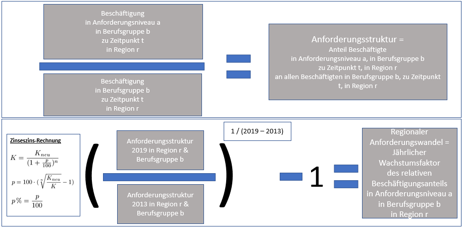
```


##Vorausberechnung 2: IHK-Fachkräftemonitor


### IHK-FKM basiertes Modell

#### Datengrundlage

#### Ergebnisse

### Fortschreibung vergangener Entwicklungen (unser Modell)

#### Datengrundlage

#### Ergebnisse

# Abgleichung von Qualifikationsangebot und -nachfrage

## Abgleich zwischen nachgefragten Qualifikationsniveaus am Arbeitsort und Angebot am Wohnort

## Pendlerströme als Angleichung von Missmatchen

# Fazit

# Anhang


<!-- # Methodik Qualifikationsangebot -->

<!-- ## Primar- & Sekundarbereich -->

<!-- ### Allgemeinbildene Schulen -->

<!-- #### Vorgehensweise in vergleichbaren Studien -->

<!-- **Kultusministerkonferenz: Vorausberechnung der Schüler- und Absolventenzahlen 2019 bis 2030** -->

<!-- Die Kultusministerkonferenz hat als Datengrundlage für die Vorausberechnung die zum Berechnungszeitpunkt aktuellsten länderspezifischen Bevölkerungsprognosen verwendet. [@Kultusministerkonferenz.2020, S. 16] -->

<!-- -- -->

<!-- Um die Anzahl der Schüler/innen aus den Bevölkerungsprognosen zu bestimmen, wurde zunächst die Schulpflicht in den jeweiligen Bundesländern herangezogen. Für allgemeinbildende Schulen liegt diese bei neun bzw. zehn Jahren (z.B. in Nordrhein-Westfalen), das bedeutet, dass prinzipiell alle Kinder und Jugendliche im Alter von 6 bis 14 bzw. 15 Jahren allgemeinbildende Schulen aufsuchen. Die Anzahl der Schüler/innen sollte  demnach mit der Zahl der Kinder und Jugendlichen im entsprechendem Alter gleichzusetzen sein. Im Anschluss an die Vollzeitschulpflicht gilt für die Kinder und Jugendlichen eine dreijährige Teilzeitschulpflicht. In dieser können sie entweder vollzeitliche allgemeinbildende oder berufliche Bildungsgänge aufsuchen oder während einer betrieblichen Ausbildung, die berufliche Schule in Teilzeitform aufsuchen. Aus diesem Grund ordnet die Kultusministerkonferenz Jugendliche im Alter von 17 oder 18 Jahren als Schüler/innen ein. [@Kultusministerkonferenz.2020, S. 19] -->

<!-- -- -->

<!-- Ab dem 19. Lebensjahr verlässt ein großer Teil der Bevölkerung das Bildungssystem. Nach wie vor erhalten bleiben diejenigen, die ein Studium an einer Hochschule/Fachhoschschule, eine berufliche Weiterbildung an einer Fachschule oder Fachakademie, eine zweite Ausbildung oder Abiturienten die ihre erste Berufsausbildung absolvieren zuzüglich derer, die mit über 20 allgemeinbildende Schulabschlüsse nachholen. Die Kultusministerkonferenz sieht die Bevölkerungsgruppe im Alter von 5 bis 29 Jahren als primär bildungsrelevante Bevölkerung. Der Anteil der 30-Jährigen im Bildungssystem wird als gering und zunehmend sinkend angesehen. [@Kultusministerkonferenz.2020, S. 19] -->

<!-- -- -->

<!-- Die Kultusministerkonferenz erläutert an dieser Stelle jedoch nicht, wie mit der Bevölkerungsgruppe von 19 bis 29 Jahren gerechnet wird, bzw. wie hoch der Anteil der Schüler/innen in dieser Bevölkerungsgruppe ist. [@Kultusministerkonferenz.2020, S. 19] -->

<!-- -- -->

<!-- Die Bevölkerungsvorausberechnungen der Länder gehen dabei von einem leichten Anstieg der Geburtenhäufigkeit aus [@Kultusministerkonferenz.2020, S. 20] -->

<!-- -- -->

<!-- Auf die Bevölkerungsprognosen wird das tatsächlich gemessene Übergangsverhalten in den einzelnen Schularten übertragen. Die Schüler- und Absolventenprognose wird mit einer "Status-Quo-Rechnung" durchgeführt. Dabei wird das Übergangsverhalten anhand der Eintritts-, Übertritts und Abgangsquoten der Jahre 2018 und 2019 bestimmt. So werden Tendenzen aus diesen Jahren mitberücksichtigt und in die Folgejahre fortgeschrieben. -->

<!-- Für die allgemeinbildenden Schulen werden Schülerzahlen nach dem Übergangsquotenverfahren projiziert, indem aus den Schülerbeständen zweier aufeinander folgenden Schuljahre und Klassenstufen eine Quote gebildet wird, welche Zu- und Abgänger anhand einer Zahl zusammenfasst. Mit dieser Zahl werden ebenfalls die Nichtversetzungen, die Abgänge und sonstigen Zugänge berücksichtigt [@Kultusministerkonferenz.2020, S. 16 ff.] -->

<!-- -- -->

<!-- Für die Eintrittsquoten für Schüler/innen, welche in die 1. Klasse eintretenn wird die Prognose der schulpflichtigen Bevölkerung verwendet.~quote[S.~17]{Kultusministerkonferenz.2020} -->

<!-- -- -->

<!-- **2017 BMSB NRW: Schülerprognose und Schulabgängerprognose zum Schuljahr 2049/2050** -->

<!-- Das Ministerium für Bildung und Schule des Landes Nordrhein-Westfalen hat 2017 eine Schülerprognose und Schulabgängerprognose für den Zeitraum vom Schuljahr 2017/2018 bis 2049/2050 erstellt.  -->

<!-- Als Basis für die Vorausberechnung diente das Schuljahr 2016/2017, gemessene Entwicklungen im Schulsystem wurden für den Prognosezeitraum fortgeschrieben. -->

<!-- Gleichzeitig weist das BMSB auch darauf hin, dass die Zuwanderungszahlen der Jahre 2015 und 2016 in diesem Ausmaß voraussichtlich nicht mehr erreicht werden sollten. Aus diesem Grund muss davon ausgegangen werden, dass die Einschulungs- und Übergangsquoten wieder auf der Niveau der Vorjahre ändern werden.~quote[S.~4]{MinisteriumfurSchuleundBildungdesLandesNordrheinWestfalen.Oktober2017} -->

<!-- -- -->

<!-- Auch in dieser Prognose dient die Bevölkerungsvorausberechnung von IT.NRW als Grundlage. Die hier verwendete Version ist aus dem Jahr 2015 und verwendet anhand des vom Zensus 2011 ermittelten Bevölkerungsstand zum 01.01.2014. Die verstärkte Zuwanderung der Jahre 2015 und 2016 konnte hier also nicht erfasst werden.~quote[S.~4]{MinisteriumfurSchuleundBildungdesLandesNordrheinWestfalen.Oktober2017} -->

<!-- -- -->

<!-- Die Altersjahrgänge werden dabei mit den Schulstufen in Verbindung gesetzt. Eine vollkommene Übereinstimmung der 6- bis unter 10-Jährigen mit allen Schülern/innen der Primarstufe ist jedoch nicht gegeben und der 10- bis unter 16-Jährigen mit allen Schülern/innen der Sekundarstufe I ist trotz Vollzeitschulpflicht jedoch nicht gegeben. Das Einschulungsalter kann zwischen 5 und 7 Jahren variieren, es kann in beiden Stufen zu Klassenwiederholungen bzw. einer dreijährigen Schuleingangsphase kommen Schüler/innen der Schulen für Kranke sind in den Zahlen der Schulstufen nicht erfasst.  -->

<!-- Schuleingänger/innen werden anhand einer Eingangsquote berechnet, welche sich auf die Anzahl der Kinder im typischem Einschulungsalter aus der Bevölkerungsvorausberechnung bezieht. Die Anzahl der Schüler/innen in den verschiedenen Jahrgangsstufen werden mittels einer Übergangsquote (s.o.) ermittelt. Als Übergänge werden Versetzungen, Nichtversetzungen, Abgänge und Zugänge aus anderen Schulformen und weitere Wanderungssalden gezählt.  -->

<!-- Die Prognose der Schulabgänger/innen erfolgt durch die zuletzt empirisch gemessen Angängerquoten.~quote[S.~4--5]{MinisteriumfurSchuleundBildungdesLandesNordrheinWestfalen.Oktober2017} -->

<!-- -- -->

<!-- **Kalinowski: BIBB-Angebotsprojektion nach Qualifikationsstufen und Berufen bis 2035** -->

<!-- Die Bevölkerung wird im Modell der BIBB in zwei Gruppen unterteilt. Die erste Gruppe beinhaltet alle Personen, die sich in Ausbildung befinden, also Schülerinnen und Schüler in allgemeinbildenden Schulen sowie an beruflichen Schulen. Des Weiteren Auszubildende in einer betrieblichen Berufsausbildung und Studierende an Hochschulen. In der zweiten Gruppe befinden sich alle weiteren Personen.~quote[S.~5]{Kalinowski.2018} -->

<!-- -- -->

<!-- Die Fortschreibung der Personen, welche sich nicht in Ausbildung befinden (Gruppe 2), erfolgt durch eine Gleichung:~Der Bestand zum Jahresende entspricht dem Vorjahresbestand, zuzüglich Nettoübergänge aus dem Bildungssystem (Gruppe 1), des Wanderungssaldos und abzüglich der Sterbefälle. Beim Wanderungssaldo wird davon ausgegangen, dass dies die gleiche Qualifikationsstruktur aufweist wie die Nettoabgänge aus dem Bildungssystem~quote[S.~6]{Kalinowski.2018} -->

<!-- -- -->

<!-- Für die Vorausberechnung der Bevölkerung wird die QuBe-Bevölkerungsprojektion verwendet, die auf der IAB Bevölkerungsprojektion beruht. -->

<!-- Um die Anzahl der Schülerinnen und Schüler, der Absolventinnen und Absolventen die Anzahl der Studierenden wurden interne Vorausschätzungen der BIBB verwendet. Die Bildungsentscheidungen werden hier konstant gehalten (Status-quo Annahme).~quote[S.~6]{Kalinowski.2018} -->

<!-- -- -->

<!-- Um die Zahl der Schülerinnen und Schüler und der Studierenden zu projizieren wurde für das Jahr 2016  die Schulbesuchsquoten bzw. der Anteil der Studienanfänger an der gleichaltrigen Bevölkerung mit den zukünftigen Bevölkerungsstand (siehe oben) für die Jahre des Untersuchungszeitraums, 2016 bis 2035, multipliziert. Der Studienanfängeranteil wird dabei konstant gehalten [@Kalinowski.2018, S. 7] -->


<!-- #### Methodik: Vorausberechnung der SchülerInnen bis 2040 -->

<!-- #### Methodik: Vorausberechnung der erworbenen Abschlüsse bis 2040 -->

<!-- ### Berufliche Schulen -->

<!-- #### Vorgehensweise in vergleichbaren Studien -->

<!-- **Kalinowski: BIBB-Angebotsprojektion nach Qualifikationsstufen und Berufen bis 2035** -->

<!-- Für die beruflichen Schulen (in NRW:~Berufskolleg) wurden für das Jahr 2016 spezielle Erfolgsquoten berechnet. Die Abgänger mit einem Abschlusszeugnis wurden mit den Abgängern insgesamt ins Verhältnis gesetzt.  -->
<!-- Die Erfolgsquoten im dualen System erfordert "zudem die Berechnung der Abgänger, die sich indirekt aus der Bestandsveränderung gegenüber dem Vorjahr (t-1) und den neuabgeschlossenen Ausbildungsverträgen (Neu) im Berechnungsjahr (t) ergeben." -->

<!-- "Die Anzahl der Prüfungsteilnehmerinnen und Prüfungsteilnehmer mit bestandener -->
<!-- Abschlussprüfung (Pt) wird anschließend ins Verhältnis zu den errechneten Abgängen -->
<!-- gesetzt." [@Kalinowski.2018, S. 9] -->

<!-- #### Methodik: Vorausberechnung der SchülerInnen bis 2040 -->

<!-- #### Methodik: Vorausberechnung der erworbenen Abschlüsse bis 2040 -->


<!-- ## Tertiärbereich -->

<!-- ### Aufstiegsfortbildung -->

<!-- #### Vorgehensweise in vergleichbaren Studien -->

<!-- #### Methodik: Vorausberechnung der TeilnehmerInnen bis 2040 -->

<!-- #### Methodik: Vorausberechnung der erworbenen Abschlüsse bis 2040 -->

<!-- ### (Fach-)Hochschulbildung -->

<!-- #### Vorgehensweise in vergleichbaren Studien -->

<!-- **Kalinowski: BIBB-Angebotsprojektion nach Qualifikationsstufen und Berufen bis 2035** -->

<!-- Für die Berechnung der Erfolgsquoten für Studierende wird die Anzahl der AbsolventenInnen nach Ablauf der durchschnittlichen Regelstudiendauer mit der Anzahl der StudienanfängerInnen ins Verhältnis gesetzt.  -->
<!-- Diese Berechnung ist nicht für StudienanfänerInnen im Masterstudium anwendbar [@Kalinowski.2018, S. 10]. -->

<!-- -- -->

<!-- Für die Vorausberechnung der Bevölkerung wird die QuBe-Bevölkerungsprojektion verwendet, die auf der IAB Bevölkerungsprojektion beruht. -->
<!-- Um die Anzahl der Schülerinnen und Schüler, der Absolventinnen und Absolventen die Anzahl der Studierenden wurden interne Vorausschätzungen der BIBB verwendet. Die Bildungsentscheidungen werden hier konstant gehalten (Status-quo Annahme) [@Kalinowski.2018, S. 6] -->

<!-- -- -->

<!-- Um die Zahl der Schülerinnen und Schüler und der Studierenden zu projizieren wurde für das Jahr 2016  die Schulbesuchsquoten bzw. der Anteil der Studienanfänger an der gleichaltrigen Bevölkerung mit den zukünftigen Bevölkerungsstand (siehe oben) für die Jahre des Untersuchungszeitraums, 2016 bis 2035, multipliziert. Der Studienanfängeranteil wird dabei konstant gehalten [@Kalinowski.2018, S. 7]. -->


<!-- #### Methodik: Vorausberechnung der Studierenden bis 2040 -->

<!-- #### Methodik: Vorausberechnung der erworbenen Abschlüsse bis 2040 -->


## Literaturübersicht (Ergebnisse anderer Studien)

## Methodik: IHK-FKM basiertes Modell
## Methodik: Fortschreibung vergangener Entwicklungen

# Literatur
